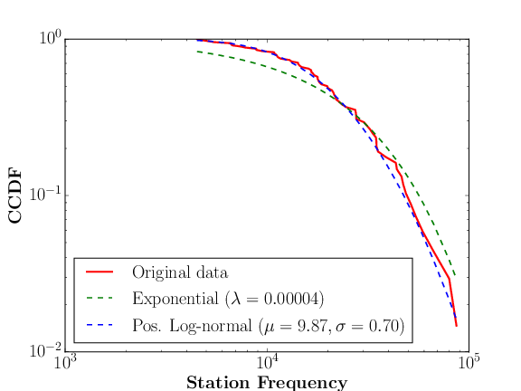
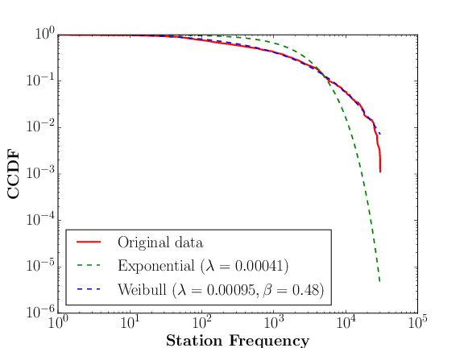

# A személyes adat és a GDPR

Ebben a posztban először áttekintjük a személyes adat fogalmát példákkal illusztrálva, ahogyan azt a 2018. május 25-én érvénybe lépő [új európai adatvédelmi rendelet (GDPR)](http://eur-lex.europa.eu/legal-content/HU/TXT/HTML/?uri=CELEX:32016R0679&from=HU) definiálja. A GDPR kötelezettségei bárkire vonatkoznak, aki európai uniós polgár személyes adatát tárolja vagy dolgozza fel (függetlenül ezek helyétől), és a kötelezettségek mulasztása [jelentős anyagi](https://www.privacy-regulation.eu/hu/83.htm) és jogi következményekkel járhat. Viszont az adat személyes jellegének megítélése korántsem könnyű, amit különböző példákkal is szemléltetünk. Megmutatjuk, hogy egy Budapest nagyságú városban a tömegközlekedést használó emberek által meglátogatott állomások listája egyedi, és kevesebb mint 5 állomás ismerete elég ahhoz, hogy egy ilyen adatbázisban bárki azonosítson egy utast. Más szavakkal kizárólag az állomások listája utasonként (név, cím, stb. nélkül) jó eséllyel személyes adatnak minősül. A probléma aktualitását a közeljövőben Budapesten is bevezetésre kerülő [elektronikus jegyrendszer]( http://rigo.bkk.hu/) adja, ami lehetővé teszi az utasok által meglátogatott állomások rögzítését.

## Mi a személyes adat?

Az [általános európai adatvédelmi rendelet](http://eur-lex.europa.eu/legal-content/HU/TXT/HTML/?uri=CELEX:32016R0679&from=HU) ([General Data Protection Regulation (GDPR)]( http://eur-lex.europa.eu/legal-content/EN/TXT/HTML/?uri=CELEX:32016R0679&from=EN)) értelmében személyes adatnak minősül minden olyan információ, ami egy *azonosított* vagy *azonosítható* természetes személyre vonatkozik ([Cikk 4(1)]( https://www.privacy-regulation.eu/hu/4.htm)).
Például ha egy kórházi adatbázisban szerepel a betegek neve, lakóhelyük irányítószáma,
valamint a betegség diagnózisa (1. táblázat), akkor ez személyes adat ha „valaki” (egy támadó, aki az adatbázishoz hozzáfér) képes meghatározni, hogy egy rekord (sor) melyik személyhez tartozik.
Első pillantásra az 1. táblázat személyes adatnak tűnik a megjelenő nevek mint azonosítók miatt. A valódi válasz egy kicsit árnyaltabb,
mivel előfordulhat, hogy minden névhez több olyan természetes személy tartozik a populációban (pl. Magyarország), akik ugyanabban a kerületben laknak és az adatbázisban nem szerepelnek.

| Rekord | Név | Irányítószám | Betegség |
| --- |---|---|---|
|1. |Fehér Csaba | 1123 | Appendicitis |
|2. | Kovács Kálmán |1117| Meningitis |
|3. | Nagy Tibor | 1113 | Gastroenteritis |
|4. | Kovács Ferenc | 1114 | Alzheimer |
| .. | ... | ... | ...|

1\. táblázat: Kórházi adatok

Tegyük fel, hogy Terike néni szomszédja Kovács Ferenc, aki Budapesten lakik.
Terike néni nagy valószínűséggel nem fogja tudni megmondani, hogy a 4. rekord a szomszédjához tartozik, mivel több Kovács Ferenc is élhet a XI. kerületben azonos adatokkal, és nem tudja, milyen betegségben szenved a szomszédja.  Ha viszont Terike néni és szomszédja egy 100 fős
községben lakik vidéken, ahol csak egyetlen Kovács Ferenc lakik (2. táblázat), akkor Terike néni teljes bizonyossággal
kikövetkeztetheti, hogy a 4. rekord a szomszédjához tartozik. A név és irányítószám külön-külön *„kvázi” azonosítója* a vidéki K. Ferencnek, de együtt már egyedi  azonosítók Terike néni számára. A budapesti K. Ferencnek (1. táblázat) viszont együttesen is csak kvázi azonosítója a két attribútum.

| Rekord | Név | Irányítószám | Betegség |
| --- |---|---|---|
|1. |Tóth Csaba | 1123 | Appendicitis |
|2. | Nagy Kálmán |1117| Meningitis |
|3. | Nagy Tibor | 1113 | Gastroenteritis |
|4. | Kovács Ferenc | 8423 | Alzheimer |
| .. | ... | ... | ...|

2\. táblázat: Kórházi adatok vidéki betegekkel

Vagyis a 2. táblázat tartalmaz*hat* személyes adatot (Kovács Ferenc, aki egy kis községben lakik),
még akkor is, ha a többi rekord nem minősül személyes adatnak *Terike néni számára* (pl. mert a többi beteg Budapesti, és rekordjaikhoz több természetes személy illeszkedik).

Most tegyük fel, hogy Zsuzsa néni nővér, aki nem ismeri K. Ferencet, és hozzáfér a 1. táblázathoz. Mivel Zsuzsa néni férje NAV ellenőr, ezért hozzáfér minden budapesti demográfiai adatához is (3. táblázat), és látja, hogy Budapesten a XI. kerületben három K. Ferenc él, akik rendre 26, 35, es 65 évesek. Tehát az 1. táblázat 4. rekordja a 3. táblázat 3. rekordjához tartozik, mivel az Alzheimer ritka 26 és 35 éves korban. Vagyis Zsuzsa néni jó eséllyel újra azonosította a kórházi adatbázis 4. rekordját, és így az személyes adat *Zsuzsa néni számára* (ahol az egyedi azonosítók a név, irányítószám és betegség együtt).

|Rekord | Név | Adóazonosító jel | Irányítószám | Születési idő |
|--- | ---|---|---| --- |
|1. | Nagy Olivér | 2346758913 | 8417 | 1965-12-12 |
|2. | Kovács Ferenc | 6730861841 | 1114 | 1991-03-01 |
|3. | Kovács Ferenc | 9770861942 | 1114 | 1952-05-08 |
|4. | Kovács Ferenc | 4730361143 | 1114 | 1982-11-28 |
|5. | Nagy Rajmund | 8462051823| 1434 | 1954-11-30 |
|6. | Papp Lajos | 7351233971| 5423 | 1988-05-24 |
| ... | ... | ... | ... | ... |

3\. táblázat: Demográfiai adatok

Utolsó példaként vegyünk egy átalakított kórházi adatbázist (4. táblázat), ami abban különbözik az elsőtől, hogy minden beteghez
tárolják a születési dátumot is, viszont a nevük helyett csak a nemüket (férfi/nő) rögzítik.

| Rekord | Nem | Irányítószám | Születési dátum | Betegség |
|--- | ---|---|---| --- |
|1. | Férfi | 1123 | 1943-01-02 | Appendicitis |
|2. | Férfi |1117| 1976-08-12 | Meningitis |
|3. | Férfi | 1113 | 1981-01-31 | Gastroenteritis |
|4. | Férfi | 1114 | 1971-03-01 | Bronchitis |
| ... | ... | ... | ... | ...|

4\. táblázat: Kórházi adatok átalaktíva

Első ránézésre egy ilyen adatbázis már nem tartalmaz személyes adatot, hiszen a nevet (mint attribútumot) eltávolítottuk. Paradox módon,
egy ilyen adatbázis is tartalmazhat személyes adatot, mivel a születési dátum, nem, és írányítószám együttese azonosíthat valakit (ugyan sok ezer ember született azonos napon mint K. Ferenc vagy lakik azonos irányítószám
alatt, azon emberek száma akik azonos napon születtek **és** az irányítószámuk is azonos K. Ferenc irányítószámával már jóval kevesebb).
[Több tanulmányban]( http://www.privacylives.com/wp-content/uploads/2010/01/golle-reidentification-deanonymization-2006.pdf) is megmutatták, hogy egy több milliós populációban az egyének közel 63%-ának egyedi a nem- irányítószám-születési dátum együttese, vagyis jó eséllyel nincs még egy olyan ember Magyarországon, aki azonos nemű, akkor született, és ott lakik mint az Olvasó.

Tegyük fel, hogy Gizi néni (vagy férje) egy állami szervnél dolgozik, ahol hozzáfér az állampolgárok pontos
születési idejéhez és lakhelyéhez (3. táblázat). A fentiek miatt egy olyan kórházi adatbázisban mint a 4. táblázat akár a betegek 63%-ához hozzárendelheti a pontos identitásukat, hiszen minden kórházi rekordhoz hozzá tudja rendelni a neki megfelelő állampolgári adatokat *ha az irányítószám, születési dátum és nem (mint attribútumok) implicit vagy explicit módon megjelennek mindkét adatbázisban*.
Ebben az esetben a név, irányítószám és nem együttese egyedi azonosítója az emberek 63%-ának *Gizi néni számára*.

### Plauzibilitás és sikervalószínűségek

Jogosan felmerülhet a kérdés: ha Zsuzsa néni jó eséllyel újra tudja azonosítani az 1. táblázat 4. rekordját, de Terike néni nem, akkor az személyes adat-e a GDPR szerint? Hasonlóan ha Gizi néni minden embert 63%-os valószínűséggel azonosít, de egyiket sem teljes bizonyossággal, akkor a 4. táblázat bármely rekordja személyes adatnak minősül vagy sem? Hasonló bizonytalanság fellép Zsuzsa néni esetében, hiszen ritkán, de [fiatal felnőttek is szenvedhetnek Alzheimer kórban]( https://en.wikipedia.org/wiki/Early-onset_Alzheimer%27s_disease). Terike néni hihetőbb támadónak tűnik mint a többiek, hiszen neki „csak” a kórházi adatokhoz kell hozzáférnie és nincs szüksége a 3. táblázatra, hogy a szomszédja adatát lokalizálja az 1. táblázatban. Ugyanakkor Zsuzsa és Gizi néni K. Ferencen kívül számos más személyt is újra azonosíthatnak, hiszen hozzáférnek a demográfiai adatokhoz.
A GDPR nem definiál explicit felső korlátot arra, hogy mennyire kell egy támadónak plauzibilisnek lennie, és arra sem, hogy ilyen támadásoknak milyen minimális sikervalószínűségűeknek kell lenniük ahhoz, hogy egy (vagy több) rekord azonosítható legyen (azaz személyesnek minősüljön). Viszont megköveteli, hogy a sikervalószínűségek ésszerűen alacsony értékek legyenek az adatbázisban szereplő minden személyre a lehető legtöbb plauzibilis támadót figyelembe véve ([Recital 26](https://www.privacy-regulation.eu/hu/r26.htm)).

A plauzibilitás és sikervalószínűségek becslésénél figyelembe kell venni, hogy a potenciális támadók nem feltétlenül ismerik a (kvázi) azonosítók összes elemét (pl. csak az irányítószámot, de a születési dátumot nem), valamint ezek megtanulása túl költséges lehet számukra.
Például ha a való életben létezik egy Terike néni (vagyis plauzibilis, hogy ismeri a szomszédja néhány adatát és hozzáfér a 2. táblázathoz), akkor K. Ferenc rekordja a 2. táblázatban személyes adatnak minősülhet. Ha Zsuzsa és Gizi néni létezése hihető (vagyis plauzibilis, hogy hozzáférnek a 3. és 4. táblázathoz és ez számukra nem okoz túl nagy költséget), akkor K. Ferenc rekordja az 1. és 4. táblázatban is személyes adatnak minősülhet. 

**Egy adat személyes jellege tehát attól függ, hogy milyen potenciális támadók férhetnek hozzá az adathoz és azok képesek-e meghatározni legalább egy rekord tulajdonosát mint természetes személyt.**
Ennek megítéléséhez szükséges minden plauzibilis támadás feltérképezése és azok sikervalószínűségeinek becslése.

Megjegyzések:

* A fenti **adatok nem azért minősülnek személyesnek, mert érzékeny információt tartalmaznak (pl. betegség), hanem azért, mert egy plauzibilis támadó képes megmondani, hogy melyik rekord melyik természetes személyhez tartozik, függetlenül az adat jellegétől.** Más szavakkal, ha a fenti táblázatok nem tartalmaznák a betegséget mint attribútumot, attól még személyes adatnak minősülhetnek és vonatkozhatnak rá a GDPR kötelezettségei.
* Általánosan igaz, hogy a belső alkalmazottak (a fenti esetben nővérek) gyakran a legvalószínűbb támadók,
hiszen részükről kevés technikai felkészültséget igényel az adatlopás (eleve hozzáférésük
van az adatbázisokhoz) függetlenül attól, hogy milyen biztonsági megoldásokkal (tűzfal, jelszó,
antivírus szoftver, hálózati szegregálás, stb.) védik a kórházi és állami rendszereket külső „hacker” támadásoktól (miközben [ezen védelmek sem nyújtanak garanciát](https://www.theguardian.com/business/2014/oct/02/jp-morgan-76m-households-affected-data-breach) külső támadásokkal szemben).
* A gyakorlatban szükséges lehet az egyes támadások **kockázatának elemzése**, amit a GDPR is megkövetel az [Adatvédelmi hatásvizsgálat](https://www.privacy-regulation.eu/hu/35.htm) (Data Protection Impact Assessment) részeként. Egy ilyen elemzés a plauzibilitás és sikervalószínűségek becslésén túl szükségessé teheti a támadásban érintett személyek/rekordok számának becslését (scale), illetve a személyeknek okozott potenciális materiális/erkölcsi/fizikai károkat (impact). Például Gizi és Zsuzsa néni kevésbbé plauzibilisek mint Terike néni, de lényegesen több személyt újra azonosíthatnak, és így az általuk okozott potenciális kár is lényegesen nagyobb lehet (például ha továbbadják az újra-azonosított adatokat).

## Személyes adatok mérése

Hogyan állapíthatjuk meg, hogy egy adatbázis személyes adatokat tartalmaz és így a GDPR hatásköre alá esik?
Néhány esetben ez könnyű, például amikor egy rekord valamely plauzibilis támadó által könnyen megismerhető egyedi azonosítót tartalmaz (pl. TAJ szám vagy bankszámlaszám). Akkor sem túl nehéz, ha létezik olyan publikusan elérhető másik adatbázis (3. táblázat), amely tartalmazza az azonosítók értékeit néhány rekordra; vagyis Zsuzsa és Gizi néni plauzibilis.

Általános esetben viszont meg kell becsülni minden plauzibilis támadó sikervalószínűségét, ami általában lehetetlen
(ez persze nem ment fel a GDPR kötelezettsége alól, amely [előír](https://www.privacy-regulation.eu/hu/35.htm) egy ilyen
„best-effort" jellegű elemzést az adat felhasználásától függően). Honnan lehetne tudni, hogy a támadók akik hozzáférhetnek a kórházi adatokhoz (pl. alkalmazott, biztosító, bank, stb.) mit tudhatnak egy betegről, ami a beteg egyedi azonosítója lehet *a populációban*?

Vegyük Zsuzsa néni esetét K. Ferenccel, de most Zsuzsa néni csak a 3. és 5. táblázatokhoz fér hozzá. Zsuzsa néni látja a 3. táblázatban, hogy a XI. kerületben három K. Ferenc nevű ember él. Mivel Zsuzsa néni lelkes Facebook/Instagram felhasználó, ezért talál egy K. Ferenc nevű felhasználót, aki a megosztott képei alapján a XI. kerületben lakik, a 20-as éveiben jár, és krónikus bőrkiütésben szenved (a pontos betegségét ez alapján még nem ismeri). Ebben az esetben az 5. táblázat 4. rekordja valószínűleg a 3. táblázat 2. rekordjához tartozik, mivel az 5. táblázatban a másik két betegségnek nem tünete a bőrkiütés. Vagyis ebben az esetben az 5. táblázat 4. rekordja  személyes adatnak minősülhet, amelynek egyedi azonosítója a neve, az irányítószáma, a születési éve, és a betegségének egy tünete (bőrkiütés).

| Rekord | Nem | Irányítószám | Születési dátum | Betegség |
|--- | ---|---|---| --- |
|1. | Kovács Attila | 1123 | 1943-\*-02 | Meningitis |
|2. | Kovács Attila |1123| 1943-\*-02 | Appendicitis |
|3. | Kovács Ferenc | 1114 | 19\*-\*-\* | Influenza |
|4. | Kovács Ferenc | 1114 | 19\*-\*-\* | Crohn-betegség |
|5. | Kovács Ferenc | 1114 | 19\*-\*-\* | Lábfejtörés |
|6. | Nagy Tibor | 1313 | 1981-\*-\* | Meningitis |

5\. táblázat: Kórházi adatok

Látható, hogy nagyon **nehéz feltételezéséket tenni egy támadó háttértudására és így meghatározni a plauzibilitását**. Napjainkban egyre több adatot osztanak meg az emberek magukról és egymásról, akarva vagy akaratlan; így nem lehet tudni, hogy ki rendelkezik elég tudással ahhoz, hogy megtalálja az illető rekordját egy adatbázisban.

### Adatok egyedisége az adatbázisban és a populációban

A fenti nehézségek ellenére a GDPR [előírhatja](https://www.privacy-regulation.eu/hu/35.htm) az adatok azonosíthatóságának „best-effort" elemzését, aminek megítélése sajnos elég szubjektív, hiszen mindig kimaradhat egy Terike/Zsuzsa/Gizi néni a felsorolásból, akinek létezése csak később lesz nyilvánvaló. Vagyis **az adat azonosíthatósága (és személyes jellege) idővel változhat**. Ennek a rendelet tudatában van, és ezért ezekben az esetekben [újabb](https://www.privacy-regulation.eu/hu/35.htm) analízist ír elő.

Az azonosíthatóság eldöntéséhez szükséges tudnunk, hogy egy rekord attribútum-értékei mennyire egyediek a populációban (és nem az adatbázisban), ahonnan a rekord számazik. Visszautalva az első példára, ha több Kovács Ferenc nevű ember él a XI. kerületben, akkor az 1. táblázat 4. rekordja nem személyes adat Terike néni (és valószínűleg senki más) számára. Annak eldöntése, hogy egy rekord egyedi-e az adott populációban viszont általában nehéz, hiszen ritkán ismerjük a populáció minden tagját. Ugyan léteznek [statisztikai modellek és eszközök rekordok egyediségének becslésére egy populációban]( http://www.ihsn.org/sites/default/files/resources/ihsn-working-paper-007-Oct27.pdf), ezen modellek többsége legjobb esetben is csak az átlagos, de nem a legrosszabb esetekre adnak valamilyen mérőszámot rekordok egyediségére.

A személyes adatok egy egyszerűbb és objektívebb indikátora a gyakorlatban a rekordok egyedisége **az adatbázisban** (és nem a populációban).
Egy rekord egyedi, ha attribútumok egy részhalmazának értékei (amit egy plauzibilis támadó ismerhet, és így azonosíthatja a rekord tulajdonosát) egyediek rá nézve
az adatbázisban, vagyis nincs más rekord aminek ilyen attribútum-értékei lennének.
A fenti példában, ha K. Ferenc egyedi a nemét, irányítószámát, és születési
dátumát nézve a 2. táblázatban, akkor Terike néni könnyen lokalizálhatja vidéki szomszédjának rekordját. Ha viszont k rekord rendelkezik ilyen
attribútum értékekkel, akkor Terike néni nem tudja meghatározni, hogy melyik rekord tartozik a szomszédjához, *feltéve, hogy nincs más információja szomszédja betegségének tüneteiről* (pontosabban ha tippel, akkor az esélye, hogy eltalálja a szomszédja rekordját 1/k). Ezt illusztrálja az 6. táblázat, ahol k = 2.

| Rekord | Nem | Irányítószám | Születési dátum  | Betegség |
|--- | ---|---|---| --- |
|1. | Férfi | 1123 | 1943-\*-02 | Meningitis |
|2. | Férfi |1123| 1943-\*-02 | Appendicitis |
|3. | Férfi | 8423 | 1971-01-\* | Bronchitis |
|4. | Férfi | 8423 | 1971-01-\* | Appendicitis |
|5. | Nő | 1313 | 1981-\*-\* | Appendicitis |
|6. | Nő | 1313 | 1981-\*-\* | Meningitis |

6\. táblázat: Kórházi adatok, k = 2

Természetesen, **ha egy rekord egyedi az adatbázisban, az nem jelenti azt, hogy egyedi a populációban is** (ld. a budapesti Kovács Ferenc esetét az 1. táblázatban). Azaz, egyedi rekordok az adatbázisban nem feltétlen minősülnek személyes adatnak, de nem túl biztató ilyen rekordok jelenléte; főleg, ha a populáción belüli egyediségét nem lehet cáfolni vagy az adatbázis tartalmazza a populáció nagy részét (ami nem ritka manapság).
Ezért a gyakorlatban legtöbbször csak az adatbázison belüli egyediséget használják az adat személyességének mérésére; ha egy adatbázisban vannak olyan rekordok, amelyek egyediek valamely plauzibilis támadó számára (Terike néni aki ismeri a lakhelyet, nevet és születési dátumot), akkor jó eséllyel tartalmaz személyes adatot az adatbázis.

### Komplex, sok attribútumú személyes adatok

Napjaink legtöbb adathalmaza lényegesen több attribútumot tartalmaz mint a fenti kórházi adatbázis.
Például tartalmazhatja egy személy által meglátogatott helyeket, megvásárolt termékeket, megnézett
filmeket, stb. Az összes attribútum száma ilyenkor megegyezik az összes lehetséges hellyel,
megvásárolható termékkel, vagy létező filmmel, melyek száma akár több ezer is lehet, értékük pedig
1 ha a kérdéses személy meglátogatta/megvásárolta/megtekintette az adott
helyet/árut/filmet, máskülönben 0. Egy ilyen adatbázist illusztrál a 7. táblázat, ahol az attribútumok Budapest főbb helyeinek ([POI](https://hu.wikipedia.org/wiki/POI)) felel meg.

| Rekord | Móricz Zsigmond körtér | Allee | Mom Park | ... | Széll Kálmán tér|
|--- | ---|---|---| --- | --- |
|1. | 0| 1 | 1 | ... | 0 |
|2. | 1| 1 | 1 | ... | 0 |
|3. | 0| 0 | 0 | ... | 1 |
|4. | 0| 0 | 1 | ... | 1 |
| ... | ... | ... | ... | ...| ... |

7\. táblázat: Komplex adatbázis

Az ilyen adathalmazok szinte [mindig]( https://www.cs.utexas.edu/~shmat/shmat_oak08netflix.pdf) személyes adatnak minősülnek, mivel (1) a rekordok általában egyediek az attribútumok nagy száma miatt (2) a sok attribútum közül elég csak néhanyat ismerni ahhoz, hogy a illető rekordját lokalizálni tudjuk, (3) az ilyen nagy adathalmazok gyakran a populáció nagy részét lefedik.
Például tegyük fel, hogy bárki megismerhet K darab, egy bizonyos személy által meglátogatott helyet az illető Facebook/Instagram profilját elemezve. Tegyük fel továbbá, hogy egy távközlési szolgáltató szeretné megosztani egy másik céggel a minden egyes előfizetője által meglátogatott helyek (cella tornyok) listáját úgy, hogy más attribútumot (név, telefonszám, stb.) nem oszt meg az előfizetőkről. Személyes adat-e az előfizetőnkénti meglátogatott helyek listája? Nagy valószínűséggel [igen](https://www.nature.com/articles/srep01376), hiszen kevesebb mint 5-10 torony (POI) ismerete egyedivé tesz egy rekordot. Ezt a jelenséget a következőkben illusztráljuk egy hasonló példán.

## Esettanulmány: Tömegközlekedési adatok

Példaként nézzünk egy komplexebb adathalmazt, ami egy 1.5 millió lakosú város közlekedési (metró- és busz-) hálózatának használatát tartalmazza. Adott két adatbázis, amelynek minden egyes sora megfelel egy elektronikus jegynek/bérletnek (smart kártya), és tartalmazza azon állomások listáját, ahol a jegyet/bérletet érvényesítették/leolvasták (az elektronikus jegyek többnyire időalapúak, egyetlen jegy az érvényességi idején belül több állomáson is leolvasásra kerülhet). 
A továbbiakban tegyük fel, hogy egy utas csakis egy jegyet/bérletet használt a megfigyelt időtartamban (1 hét), vagyis minden sor megfelel egy utas által meglátogatott állomások egy részhalmazának (tehát egy állomás csak egyszer szerepelhet egy rekordban).

A metró adatbázisban összesen 66 állomás (attribútum)
és 846 648 utas (rekord) található. A busz adatbázisban 861 állomás (attribútum) és 771 195 utas (rekord).
Az adatbázisok főbb jellemzőit a 8. táblázat mutatja.

| | Metró | Busz|
|--:|---|---|
| Utasok száma | 846,648 | 771,195 |
| Állomások száma | 66 |861 |
| Legtöbb állomás utasonként | 27 |54 |
| Átlagos állomások száma utasonként| 1.93 |2.64 |
| Állomások számának szórása utasonként|  1.67 |  2.51 |

8\. táblázat: Metró- és buszállomások látogatottsága

<!---
A 9. táblázatban feltüntettük az utasok által meglátogatott állomások számának eloszlását,
vagyis azon rekordok %-os arányát, amelyek legalább N meglátogatott állomást tartalmaznak.  

|N | Metró | Busz |
|--:|---|---|
|1| 100.00% |100.00% |
|2| 38.68% |55.04% |
|3| 24.20% |35.40% |
|4| 14.86% |25.75% |
|5| 8.78% |18.38% |
|6| 4.96% |13.03% |
|7| 2.69% |9.10% |

9\. táblázat: Meglátogatott állomások számának eloszlása
 -->

Két főbb támadást képzelhetünk el:
1. A támadó ismeri egy tetszőleges utas K tetszőleges állomását, és lokalizálni szeretné az utas rekordját.
2. A támadó ismeri egy tetszőleges utas K legtöbbször látogatott
állomását (vagyis az utas TOP K állomását), és lokalizálni szeretné az utas rekordját.

A cél mindkét esetben az utas többi állomásának kiolvasása a megtalált rekordból
. Mindkét támadás plauzibilis ha K nem túl nagy, hiszen szinte bármely utas nyilvános közösségi profiljából (Facebook/Instagram/Twitter stb.) könnyen meghatározhatók az általuk meglátogatott helyek, és így az azokhoz legközelebb elhelyezkedő állomások listája (pl. lakóhely,
munkahely, konditerem, szórakozóhely). A sikervalószínűség mindkét esetben K értékétől függ, amit az alábbiakban a rekordok adatbázisbeli egyediségével becslünk.

### TOP K állomások egyedisége

Először minden utas TOP K állomását meghatározzuk, majd megnézzük, hogy hány utasnak egyedi a TOP K állomása az adatbázisban. Az alábbi táblázat mutatja, hogy az adatbázis rekordjainak hány százaléka egyedi a TOP K állomásukat tekintve azon rekordok közül, amelyek tartalmaznak legalább K állomást. Zárójelben feltüntettük, hogy egy ilyen támadó számára hány rekord egyedi az adatbázisban.

|Top-K | Metró | Busz |
|---|---|---|
|Top-2 | 0.03% (84 egyedi rekord) |5.56% (25 673 egyedi rekord)|
|Top-3 | 21.4% (43 315 egyedi  rekord) |41.4% (119 783 egyedi rekord)|
|Top-4 | 82.1% (120 368 egyedi rekord)|79.4% (192 163 egyedi rekord)|
|Top-5 | 97.4% (129 608 egyedi rekord)|96.3% (216 135 egyedi rekord)|

Például ha egy utas rekordja legalább 3 metróállomást tartalmaz,
akkor ez a rekord 21.4%-os eséllyel egyedi az adatbázisban.
Ugyanez az érték már 41.4% a busz-adatbázisban. Ha az összes rekordot nézzük és a támadó *legfeljebb* a TOP 3 állomást képes azonosítani minden rekordból, akkor számára 43 315 rekord lesz egyedi a metró-adatbázisban, ami az összes rekord kb. 5%-a. 
 A gyakorlatban a TOP-3 állomás könnyen meghatározható egy személyről, de sokan jóval több információt megosztanak magukról közösségi portálokon (pl. képek formájában), ezért náluk akár K > 5 támadó is lehet plauzibilis több mint 95%-os sikervalószínűséggel, feltéve ha az adatbázis elég nagy és nagyjából lefedi az egész populációt.

### Tetszőleges K állomás egyedisége

Ha egy utas rekordja *legalább* K állomást tartalmaz, akkor milyen valószínűséggel lesz a rekordja egyedi az adatbázisban egy olyan támadó számára, aki ismerheti az utas bármely K állomását?

A fenti valószínűség számításához szükséges a rekordokban előforduló összes K állomás egyediségének vizsgálatára (vagyis hány más rekordban fordulnak elő), ami túl sokáig tartana. Ezért inkább véletlen mintavételezéssel becsüljük K állomás egyediségét. A [részleteket](https://arxiv.org/pdf/1507.07851.pdf) mellőzve, erre itt egy egyszerű módszert mutatunk. 

Első lépésként véletlenszerűen kiválasztunk egy rekordot (minden olyan rekordot ugyanolyan eséllyel, ami legalább K állomást tartalmaz), majd annak K tetszőleges állomását szintén
véletlenszerűen (minden K állomást a rekordból ugyanolyan eséllyel). Végül megnézzük, hogy hány másik utas rekordja tartalmazza ezt a K állomást. A
kísérlet sikeres, ha nincs más utas akinek rekordjában szerepel ez a K állomás (vagyis az első
lépésben kiválasztott rekord egyedi a második lépésben kiválasztott állomásait tekintve).
Ezt a kísérletet megismételjük elég sokszor (pl. [30000 ismétlés már elég pontos becslést ad](https://arxiv.org/pdf/1507.07851.pdf)), és kiszámoljuk a sikeres kísérletek százalékos arányát, amelyet az alábbi táblázat mutat. Zárójelben feltüntettük, hogy ez hány rekordot érint, vagyis hány rekord tartalmaz legalább K állomást.

|K | Metró | Busz |
|---|---|---|
|2 | 12.7% (327 873 rekordra) |23.8% (425 602 rekordra)|
|3 | 20.2% (205 111 rekordra) |35.7% (273 759 rekordra)|
|4 | 32.4% (125 995 rekordra) |48.6% (198 875 rekordra)|
|5 | 52.7% (74 402 rekordra) |52.7% (142 150 rekordra)|
|6 | 74.1% (42 014 rekordra) |62.2% (100 779 rekordra)|
|7 | 87.7% (22 787 rekordra) |83.8% (70 370 rekordra)|

<!--
|K | Metró | Busz |
|---|---|---|
|2 | 0% |0.29%  |
|3 | 0.01% |2.45%  |
|4 | 0.63% |5.75%  |
|5 | 2.73% |9.26%  |
|6 | 3.94% |10.91%  |
|7 | 4.92% |13.07%  |
-->

Például ha egy utas rekordja legalább 3 metróállomást tartalmaz (ez 205 111 rekordra igaz, ami az összes rekord 24.2%-a), akkor ez a rekord 20.2%-os eséllyel lesz egyedi a metró adatbázisban.  

Látható, hogy a busz adatbázis jóval több egyedi rekordot (és így potenciálisan több személyes adatot) tartalmaz mint a metró adatbázis. Ennek egyik fő oka, hogy több buszállomás létezik (893) mint metróállomás (68), és nyilván egy utas nagyobb eséllyel lesz egyedi ha több különböző állomást látogathat meg. Ahogy ezt a következőkben is megerősítjük, az utasok egymástól valóban elég eltérő metró- és buszállomásokat látogatnak meg. 

### Egyediség egyéb indikátorai

Az egyediség egy másik és gyorsabban számolható (de kevésbé pontos) indikátora lehet a sok egyedi rekordot tartalmazó adatbázisok [két globális tulajdonsága](https://www.cs.utexas.edu/~shmat/shmat_oak08netflix.pdf): az adatritkaság
(**sparseness**) és az állomások gyakoriságának [**heavy tailed**](https://en.wikipedia.org/wiki/Heavy-tailed_distribution) eloszlása.

Egy adathalmaz ritka, ha minden utas csak néhány állomást látogatott meg. Ez a mi esetünkben valóban igaz, hiszen az
átlagos állomás-szám rekordonként kevesebb mint 3 mindkét adathalmazra, aminek a [szórása](https://en.wikipedia.org/wiki/Standard_deviation) szintén kisebb mint 3 (8. táblázat).

A heavy-tailed tulajdonság nagyjából azt jelenti, hogy a legtöbb állomás gyakorisága alacsony az adathalmazban. Precízebben fogalmazva, ha ábrázoljuk az állomások elfordulási számának (gyakoriságának) eloszlását az adatbázisban, akkor ezen eloszlás [sűrűségfüggvényének](https://en.wikipedia.org/wiki/Probability_density_function) a farka „vastagabb", mint egy [exponenciális eloszlás](https://en.wikipedia.org/wiki/Exponential_distribution) sűrűségfüggvényének farka. Ilyen ismertebb eloszlások pl. a [power law](https://en.wikipedia.org/wiki/Power_law) és a [log-normál]( https://en.wikipedia.org/wiki/Log-normal_distribution).
A következő ábrák illusztrálják a metró és busz adathalmazok heavy-tailed tulajdonságát. Ábrázoltuk az
állomások gyakoriságának a komplemens kumulatív eloszlásfüggvényét ([CCDF](https://en.wikipedia.org/wiki/Cumulative_distribution_function)), valamint az erre legjobban illeszkedő exponenciális és heavy-tailed modellt. Az ábrák jól mutatják, hogy az exponenciális modell lényegesen rosszabbul illeszkedik mint a legjobb heavy-tailed modellek, amelyek a mi esetünkben a
pozitív log-normál és [Weibull](https://en.wikipedia.org/wiki/Weibull_distribution) eloszlások voltak. Azaz, a **rekordok többsége nagy valószínűséggel egyedi!** Az illeszkedést a [powerlaw]( https://pypi.python.org/pypi/powerlaw) python csomaggal számoltuk. Érdemes megjegyezni, hogy a vizsgált heavy-tailed eloszlásoknak több paraméterük van mint az exponenciális eloszlásnak, ezért [overfitting]( https://en.wikipedia.org/wiki/Overfitting) miatt a heavy-tailed eloszlások lehet, hogy csak az adatbázist modellezik pontosabban de nem a populációt (habár ennek esélye kicsi, mivel az adatbázisok jelen esetben elég nagyok).

Metro             |  Busz
:-------------------------:|:-------------------------:
|  

## Konklúzió

Láthattuk, hogy az adatok azonosíthatóságának és így személyes jellegének megítélése attól függ, hogy ki férhet hozzá az adathoz, és milyen előzetes (háttér)tudással rendelkezik az adattulajdonosokról. Másrészt,  a támadó plauzibilitását (az egyénekről alkotott háttértudását) nehéz igazolni. Ennek oka, hogy napjainkban rengeteg adat érhető el az emberekről, amit részben ők maguk részben más [cégek](https://en.wikipedia.org/wiki/AOL_search_data_leak) vagy [személyek](http://fc13.ifca.ai/proc/10-1.pdf) osztanak meg akarva vagy akaratlanul. Az azonosíthatóság sikervalószínűségét sem mindig könnyű számolni, főleg ha az adat komplex (sok attribútumot tartalmaz).

Példaként megmutattuk, hogy egy Budapest nagyságú városban a tömegközelekedést használó emberek által meglátogatott állomások listája egyedi, és kevesebb mint 5 állomás ismerete elég ahhoz, hogy egy ilyen adatbázisban bárki azonosítson egy utast, és kiolvassa az összes általa érintett állomást. Így ez az adatbázis nagy valószínűséggel rengeteg személyes adatot tartalmaz. Ez azt is jelenti, hogy ha a rendszert üzemeltető cég meg szeretné osztani ezt az adatbázist egy harmadik féllel adatelemzés céljából (pl. hogy lássák hova kell új állomást építeni), ahhoz vagy az utasok beleegyezését kell kérniük, vagy anonimizálni kell az adatbázist úgy, hogy már nem azonosítható benne senki és így nem vonatkoznak rá a GDPR kötelezettségei. Ez a kérdés könnyen aktuálissá válhat Budapesten is	 a [közelgő elektronikus jegyrendszer]( http://rigo.bkk.hu/) bevezetésével.

<!---
Végül megjegyezzük, hogy a leírt megállapítások minden olyan adatbázisra igazak, ahol személyekről tárolnak bármilyen (nem feltétlenül érzékeny) adatot és ezek a személyek valamely plauzibilis támadó által azonosíthatók.
-->

<!---
‘personal data’ means any information relating to an identified or identifiable natural person (‘data subject’); an identifiable natural person is one who can be identified, directly or indirectly, in particular by reference to an identifier such as a name, an identification number, location data, an online identifier or to one or more factors specific to the physical, physiological, genetic, mental, economic, cultural or social identity of that natural person;

To determine whether a natural person is identifiable, account should be taken of all the means reasonably likely to be used, such as singling out, either by the controller or by another person to identify the natural person directly or indirectly. To ascertain whether means are reasonably likely to be used to identify the natural person, account should be taken of all objective factors, such as the costs of and the amount of time required for identification, taking into consideration the available technology at the time of the processing and technological developments. The principles of data protection should therefore not apply to anonymous information, namely information which does not relate to an identified or identifiable natural person or to personal data rendered anonymous in such a manner that the data subject is not or no longer identifiable. This Regulation does not therefore concern the processing of such anonymous information, including for statistical or research purposes.

remove identifying particulars or details from (something, especially medical test results) for statistical or other purposes: anonymized testing of routine blood samples.
-->

