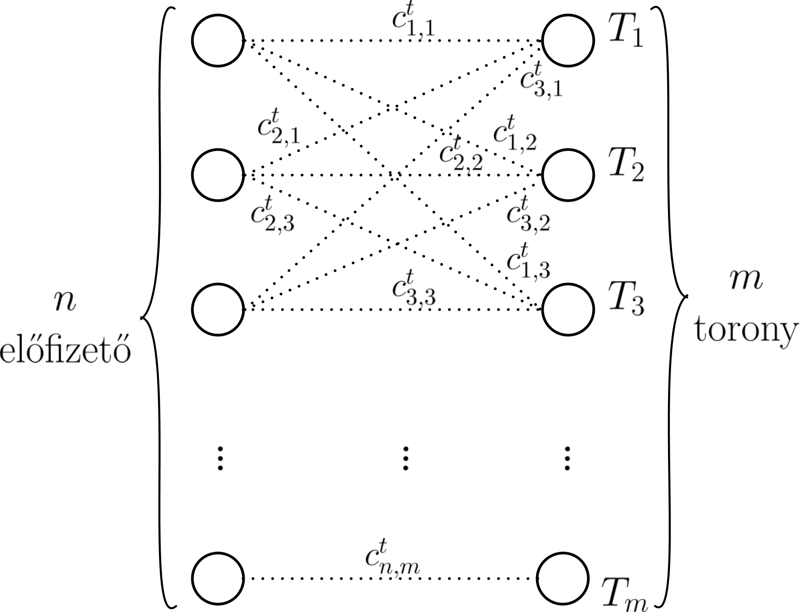

# Az aggregált adat és a GDPR

Az [előző posztban](http://blog.crysys.hu/2017/07/628/) megnéztük hogyan definiálja a [GDPR](http://eur-lex.europa.eu/legal-content/HU/TXT/HTML/?uri=CELEX:32016R0679&from=HU) a személyes adat fogalmát és mi számít személyes adatnak a gyakorlatban.
Ebben a posztban egy mérnöki (és talán jogi)  szempontból jóval izgalmasabb kérdést vizsgálunk: *Személyes adatnak minősül-e az aggregált/statisztikai adat?* 

A probléma azért érdekes, mert a legtöbb cég/kormány/szervezet statisztikai adatok tömkelegét osztja meg, mondván, ezek nem személyes adatok. Valóban, a GDPR így nyilatkozik a statisztikai adatról ([Recital 26](https://www.privacy-regulation.eu/hu/r26.htm)): _"[...] Az adatvédelem elveit [...] az anonim információkra nem kell alkalmazni, nevezetesen olyan információkra, amelyek nem azonosított vagy azonosítható természetes személyre vonatkoznak, valamint az olyan személyes adatokra, amelyeket olyan módon anonimizáltak, amelynek következtében az érintett nem vagy többé nem azonosítható. Ez a rendelet ezért nem vonatkozik az ilyen anonim információk kezelésére, a statisztikai vagy kutatási célú adatkezelést is ideértve."_
Később ([Recital 162](https://www.privacy-regulation.eu/hu/r162.htm)):
_"[...] Statisztikai célúnak minősül a személyes adatok statisztikai felmérések vagy statisztikai eredmények kiszámításának céljából történő gyűjtése és kezelése. [...] A statisztikai célból következik, hogy a statisztikai célú adatkezelés eredménye nem személyes adat, hanem összesített [aggregált] adat, és hogy ezt az eredményt vagy a személyes adatokat nem használják fel konkrét természetes személyekre vonatkozó intézkedések vagy döntések alátámasztására."_ 

Ennek a posztnak a célja megmutatni, hogy sok gyakorlati esetben statisztikai/összesített adatokból rekonstruálhatók személyes adatok (pontosabban egyének rekordjai egy adatbázisban amin az összesített adatot számolták), és  így *aggregált (összesített) adat  is lehet személyes adat, akár még a GDPR [4. preambulumának](https://www.privacy-regulation.eu/hu/4.htm)* értelmezésében is. Példaként megmutatjuk, hogy ha egy telekom cég kiadná a mobiltelefon tornyok látogatottságát az idő függvényében (vagyis minden egyes toronynál rögzített telefonhívások számát óránként), akkor ebből az összesített adatból konkrét előfizetők által meglátogatott tornyok közel 80%-a rekonstruálható, vagyis az előfizetők által meglátogatott helyek listája. Így az ilyen összesített adat lehet személyes (sőt akár érzékeny), és ebben az esetben az aggregált adatok megfelelő anonimizációja/torzítása lehet szükséges.

## Mi az aggregált adat?
A GDPR ugyan nem definiálja az aggregált (összesített) adat fogalmát, de valószínűsíthetően több egyén adatán számolt statisztikai/összesített adatot ért.  Például az 1. táblázatban aggregált adat a betegek vércukrának átlaga, vagy szórása, vagy eloszlása, stb. De aggregált adat lehet azon betegek száma, akik Alzheimer-ben szenvednek. Komplexebb lekérdezések eredményei is lehetnek aggregált adatok; például azon betegek száma akik Appendicitisben szenvednek *és* 25 évesnél fiatalabbak *és* Budapesten laknak.

FONTOS: A vizsgálat célja csakis az aggregált adat, nem az adatbázis amin az aggregátumot számoljuk. Más szavakkal a kérdés, hogy személyes adatnak minősülnek-e az aggregátumok egy olyan támadó számára, aki nem fér hozzá az adatbázishoz.

| Rekord | Nem | Irányítószám | Vércukor |  Betegség |
|--- | ---|---|---| --- |
|1. | Kovács Attila | 1123 | 4.3 | Meningitis |
|2. | Kovács Attila |1123| 5.2 | Appendicitis |
|3. | Kovács Ferenc | 1114 | 6.1 | Influenza |
|4. | Kovács Ferenc | 8423 | 3.2 | Crohn-betegség |
|5. | Kovács Ferenc | 1114 | 7.1 | Lábfejtörés |
|6. | Nagy Tibor | 1313 | 6.2 | Crohn-betegség |

1\. táblázat: Kórházi adatok

## Első példa: Célzott támadás

Tekintsük Zsuzsa nénit az [előző posztból](http://blog.crysys.hu/2017/07/628/), aki a Facebookon talál egy K. Ferenc nevű felhasználót. K. Ferenc megosztott képei alapján egy kis községben lakik aminek az irányítószámát is megadta (8423), a 20-as éveiben jár, és krónikus bőrkiütésben szenved (a pontos betegségét ez alapján még nem ismeri).  Zsuzsa néni ugyan az 1. táblázathoz nem fér hozzá, de jogosult az alábbi lekérdezéshez: Hány olyan beteg van aki az [latex]X[\latex]  irányítószám alatt lakik és a betegsége [latex]Y[\latex] ? Ezután lefuttatja az összes olyan kérést, ahol [latex]X=8423[\latex]  és [latex]Y[\latex]  pedig egy olyan betegség, aminek tünete a krónikus bőrkiütés. Ha csak egy ilyen lekérdezés értéke 1 a többié pedig 0, akkor Zsuzsa néni megtalálta K. Ferenc pontos betegségét (erre jó esély van ha K. Ferenc vidéki, és a községben ahol él más nem volt a kórházban krónikus bőrkiütéssel).

 A probléma tehát ismét az, hogy *a támadó háttértudása* (a *mindenki* számára elérhető a tény, hogy egy fiatal K. Ferenc krónikus bőrkiütésben szenved és egy ismert községben lakik) *lehetővé teheti személyes adatok visszafejtését aggregált adatokból*. Ahogyan azt az előző posztban is megmutattuk, manapság a legtöbb emberről rengeteg nyilvános adat elérhető maguk vagy mások által. Így a hasonló támadások létezését lehetetlen kizárni. Például előfordulhat, hogy Zsuzsa néni nemcsak bőrkiütést hanem egyéb más tünetet is megfigyel K. Ferencről a képei alapján, így a szóbajöhető betegségek száma kevesebb, vagyis még kevesebb lekérdezésből még nagyobb eséllyel kiderítheti K. Ferenc pontos betegségét. 

## Második példa: Több rekord bináris attribútumainak visszaállítása

A fenti támadás hatékonysága több szempontból is vitatható.
Egyrészt, egyetlen személyre irányul (vagyis célzott) és valószínűleg nem általánosítható több betegre (pl. mert a betegek többsége nyilvánosan nem oszt meg semmi információt a betegségéről).
Másrészt, a legtöbb esetben minden olyan lekérdezést tiltanak (nem válaszolnak meg), aminek az értéke túl kicsi (pl. a fenti esetben amikor csak egy beteg rekordja illeszkedik a lekérdezésre).
A következőkben ezért több személyt érintő globális (mass) támadásokra fokuszálunk, és megmutatjuk, hogy a lekérdezések tiltása nem elég. Egész pontosan *ha elég sok lekérdezést megválaszolnak, akkor egy támadó képes az eredeti rekordokat visszaállítani a lekérdezések értékeinek összességéből függetlenül azok értékeitől*. 

Vegyük példaként a 2. és 3. táblázatot, ahol a két táblázat rekordjai ugyanahhoz a személyhez tartoznak (vagyis a 3. táblázat [latex] i [\latex] -ik sora és 4. táblázat [latex]i[\latex] -ik sora ugyanazon személy adatai).  A 3. táblázat
első attribútuma az illető korát tartalmazza (ugyanaz mint a 2. táblázat 3. oszlopa), a többi attribútumok pedig Budapest főbb helyeinek ([POI](https://hu.wikipedia.org/wiki/POI)) felelnek meg, és értékük 1, ha az illető meglátogatta az adott helyet, egyébként nulla.

| Rekord | Nem | Kor | Lakhely | 
|--- | ---|  ---|  --- |
|1. | Férfi | 23 | Budapest | 
|2. | Nő | 43 | Budapest | 
|3. | Férfi | 45 | Budapest | 
|4. | Nő | 36 | Budapest | 
| ... | ... |  ...| ... |

2\. táblázat: Demográfiai adatok

A 2. táblázathoz hozzáfér a támadó, viszont a 3. táblázathoz nem. Tegyük fel továbbá, hogy a támadó az alábbi [latex]Q(X,Y,Z)[\latex]  lekérdezést hajthatja végre: Hány olyan személy van a 3. táblázatban, akik [latex][X, Y][\latex]  évesek és meglátogatták a [latex]Z[\latex]  helyet?
Vagyis [latex]Q(X,Y)[\latex]  azon rekordok számát jelöli, ahol a kor értéke legalább [latex]X[\latex]  és legfeljebb [latex]Y[\latex] , és [latex]Z[\latex]  attribútum/hely értéke 1. A támadó célja a 3. táblázat rekonstruálása a lekérdezések értékét és a 2. táblázatot felhasználva (tegyük fel, hogy [latex][X,Y][\latex]  minden megengedett értékéhez 1-nél lényegesen több rekord tartozik, lehet akár a rekordok fele).

| Rekord | Kor | Móricz Zsigmond körtér | Allee | Mom Park | ... | Széll Kálmán tér|
|--- | ---|  ---|---|---| --- | --- |
|1. |  23 | 0| 1 | 1 | ... | 0 |
|2. | 43 | 1| 1 | 1 | ... | 0 |
|3. | 45| 0| 0 | 0 | ... | 1 |
|4. | 36| 0| 0 | 1 | ... | 1 |
| ... | ... | ... | ... | ...| ... |

3\. táblázat: Helyzeti adatok

Először csak egy oszlopot rekonstruálunk, a többi hasonlóan történik. Legyen [latex]Z[\latex]  egy előre kiválasztott hely (pl. [latex]Z[\latex]  = "Allee"). A cél a 3. táblázat [latex]Z[\latex]  értékének megfelelő oszlopának rekonstruálása, amit [latex]x_1, x_2, \ldots, x_n[\latex]  ismeretlenekkel jelölünk és ahol [latex]n[\latex]  az összes rekord száma a táblázatban (vagyis [latex]x_i=1[\latex]  ha a  támadó szerint az [latex]i[\latex] -ik rekord meglátogatta a Z helyet, egyébként [latex]x_i=0[\latex] ). A  támadás lényegében egy [lineáris programozási](https://en.wikipedia.org/wiki/Linear_programming) feladat megoldása, aminek menete a következő.

1. Válaszd a kor lehetséges értékeinek egy véletlen intervallumát (pl. [latex][X=32;Y=40][\latex] )?
2. Kérdezd a [latex]Q(X,Y,Z)[\latex]  értékét 
3. Ismételd meg a fenti műveleteket [latex]t[\latex] -szer, így kapod [latex]Q_1(X_1, Y_1, Z), Q_2(X_2, Y_2, Z), \ldots, Q_t(X_t, Y_t, Z)[\latex]  lekérdezések értékét.
4. Minden [latex]Q_j[\latex]  lekérdezéshez határozd meg azon [latex]S_j \subseteq \{1,2, \ldots, n\}[\latex]  rekordok halmazát a 2. táblázatból, amelyet a [latex]Q_j[\latex]  lekérdezés lefed (vagyis a koruk a [latex][X_j, Y_j][\latex]  intervallumba esik).
4. Old meg az alábbi [latex]t[\latex]  egyenletből és [latex]n[\latex]  feltételből álló lineáris egyenletrendszert:
   $$ 
   \begin{matrix}
     \sum_{i \in S_1} x_i = Q_1(X_1, Y_1, Z),\\
      \sum_{i \in S_2} x_i = Q_2(X_2, Y_2, Z), \\
      \vdots\\
      \sum_{i \in S_t} x_i = Q_t(X_t, Y_t, Z),
   \end{matrix}
  $$
   $$\text{ahol:}\; 0 \leq x_i \leq 1$$ 

6. Kerekítsd [latex]x_i[\latex]  értékeit: [latex]x_i = 1[\latex]  ha [latex]x_i > 1/2[\latex] , máskülönben [latex]x_i = 0[\latex] 

[Bebízonyitható](http://www.cse.psu.edu/~ads22/privacy598/papers/dn03.pdf), hogy ha [latex]t= n \log^2 n[\latex] , akkor az 6. lépésben kapott [latex]x_i[\latex]  értékek jó része helyes (tehát [latex]x_1, x_2, \ldots, x_n[\latex]  megegyezik a 3. táblázat [latex]Z[\latex]  értének megfelelő oszlopával), és így az eredeti adatbázis [latex]Z[\latex]  értékének megfelelő oszlopa  rekonstruálható.

Természetesen a 3. táblázat visszaállított oszlopa önmagában még nem minősül személyes adatnak, hiszen ahhoz minden visszaállított értékhez hozzá kellene rendelni egy természetes személyt. Ezért a fenti támadás megismételhető több, mondjuk [latex]k>20[\latex] , helyre/oszlopra. Mivel a legtöbb egyént [5-10 hely már egyértelműen azonosít](https://www.nature.com/articles/srep01376), ezért a rekonstruált adatbázis összevethető publikusan elérhető Facebook/Instagram profilokkal, ahonnan egy személy/rekord azonosításához szükséges 5-10 hely már jó eséllyel beszerezhető.    

Megjegyzések:

1. A 4. lépésben megoldandó egyenletrendszer azért lineáris, mert a lekérdezések (subset-sum query) az attribútum-értékek lineáris függvénye (jelen esetben összege). Az egyenletrendszer [bármely LP solver-rel megoldható](https://en.wikipedia.org/wiki/Linear_programming#Solvers_and_scripting_.28programming.29_languages) (pl. CPLEX, glpk, stb.). 
2. Az eredeti adatbázis visszaállíthatósága [latex]t= n \log^2 n[\latex]  lekérdezés esetén garantált, ahol minden lekérdezés minden rekordot 1/2 eséllyel tartalmaz. Ez a fenti példában nem feltétlen igaz, hiszen ott a kor alapján választunk egyenletes eloszlás szerint nem pedig magukat a rekordokat 1/2 valószínűséggel. Ennek ellenére a gyakorlatban a támadás jó eséllyel működik.
3. A megoldandó egyenletrendszer [latex]n[\latex]  változót és [latex]t= n \log^2 n[\latex]  egyenletet/feltételt tartalmaz. Ennek a megoldása az elméletileg *legrosszabb esetben* [latex]O(n^5 \log^4 n)[\latex]  lépést igényel. [Létezik olyan támadás](https://www.microsoft.com/en-us/research/wp-content/uploads/2008/08/dy08.pdf), ami csak [latex]t= n[\latex]  lekérdezést (egyenletet) igényel és [latex]O(n\log n)[\latex]  futási idővel hasonló rekonstrukcós pontosságot ér el, viszont itt a lekérdezéseket determinisztikusan és nem véletlenszerűen választják. Fontos, hogy ezek a támadások (a fentit beleértve) akkor is működhetnek, ha a [lekérdezések értékéhez véletlen zajt adunk hozzá](http://www.cse.psu.edu/~ads22/privacy598/papers/dn03.pdf) (query perturbation). Ebben az esetben egyenletek helyett egyenlőtlenségeket kell megoldani. 

## Harmadik példa: "Big Bang" 
A fenti támadás azért működik, mert a támadó hozzáfér a 2. táblázathoz, és így pontosan tudja, hogy melyik lekérdezés melyik rekordot fedi le. Ha ezt nem tudná, akkor az 5. lépésben definiált egyenletrendszer nem lenne megoldható, hiszen nem tudná, hogy pontosan melyik ismeretlenek (rekordok) szerepelnek az egyenletek bal oldalán. Felmerül a kérdés: sikeres lehet-e egy olyan támadás, ahol a lekérdezések által lefedett rekordok nem ismertek a támadó számára és csak a lekérdezések értékét azaz aggregátumokat ismerheti? Ez egy gyengébb támadó jóval kevesebb háttértudással, viszont sokkal inkább hihetőbb a gyakorlatban (azaz plauzibilis). Valóban, a fenti példában a leginkább plauzibilis támadó nem fér hozzá a 2. hanem csak a 3. táblázathoz. Ha egy ilyen plauzibilis támadó sikerrel jár, akkor gyanítható, hogy az aggregált adat személyesnek minősül még a GDPR 4. preambulumának értelmében is. 

A következőkben egy [nem rég publikált támadást](https://arxiv.org/pdf/1702.06270.pdf) mutatunk be egy gyakorlati alkalmazáson.

### Az adat

Sok telekom cég szívesen megosztaná (eladná) az előfizetők hívási adataiból számolt emberek térbeli és időbeli sűrűségét egy populációban. Ez könnyen kivitelezhető, hiszen amikor egy előfizető hívást kezdeményez/fogad, SMS-t küld/fogad, rögzítésre kerül a telefon torony, amellyel az előfizető telefonja kapcsolatban van. Így minden előfizető térbeli helyzete meghatározható az idő függvényében, vagyis melyik toronynál volt amikor éppen kommunikált. Ahogy az előző posztban megmutattuk, egy ilyen adatbázis nagy valószínűséggel személyes, hiszen egy előfizető 4-5 tornya már egyedi rá nézve, vagyis nincs még egy olyan ember, aki ugyanezen helyeket meglátogatta ugyanabban az időben.  

Ezért a telekom cégek többsége az fenti adatot nem adja ki, hanem csak az abból számolt aggregátumokat. Egész pontosan volt már rá példa többször, hogy kiadták minden toronyhoz az ott tartózkodott előfizetők számát minden órában (vagyis minden toronyhoz egy idősort). Ez a statisztikai adat értékes, hiszen a tornyok sűrűn helyezkednek el (főleg sűrűn lakott helyeken), így felhasználhatók közlekedési hálózat optimalizációjára, új szolgáltatások (pl. áruházak) telepítési helyének meghatározásához, de akár járványok terjedésének modellezéséhez is. A következőkben megmutatjuk, hogy az ilyen statisztikai adat is lehet személyes.

### A támadás célja
Legyen [latex]N[\latex]  előfizető akiknek hívási adataikat rögzítik [latex]M[\latex]  toronynál az eredeti adatbázisban. Ebből az adatbázisból a cég minden [latex]t[\latex]  időpontban kiszámolja a [latex]P^t = (p_1^t, p_2^t, \ldots, p_M^t)[\latex]  látogatottságokat, ahol [latex]p_i^t[\latex]  jelöli az [latex]i[\latex] -ik toronynál levő előfzetők számát a [latex]t[\latex] -edik időintervallumban (pl. egy óra alatt), majd csakis a [latex]P^t[\latex] -t osztják meg, bízva abban, hogy az - aggregált adat lévén - nem minősül személyesnek. 
Az egyes tornyokat jelölje [latex]T_1, T_2, \ldots, T_M[\latex] .
Legyen [latex]Y_{i,j}^t = 1[\latex] , ha az [latex]i[\latex] -edik előfizető meglátogatta [latex]T_j[\latex]  tornyot a [latex]t[\latex]  időtartományban, máskülönben 0. A támadás célja az [latex]Y^t[\latex]  mátrix rekonstruálása minden [latex]t[\latex] -re úgy, hogy [latex]\sum_{i=1}^N Y_{i,j} = p_{j}^t[\latex] , vagyis az [latex]Y[\latex]  mátrix [latex]j[\latex]  oszlopában található elemek összege a [latex]T_j[\latex]  tornyot meglátogatott előfizetők száma a [latex]t[\latex] -edik intervallumban.  

### A támadás menete

A támadás először rekonstruálja a rekordokat (azaz az [latex]Y^t[\latex]  mátrixot) minden [latex]t[\latex] -re egy napon belül, feltéve, hogy [latex]P^t[\latex]  ismert. 
Ezt megismétli minden egyes napra külön-külön. Végül az azonos előfizetőhöz tartozó rekonstruált rekordokat összerendeli a napok között, felhasználva, hogy bármely előfizető minden egyes nap hasonló tornyokat látogat meg  hasonló időben (regularitás), és az előfizetők egymástól elég különböző tornyokat látogatnak meg (egyediség).

#### [latex]Y^t[\latex]  rekonstruálása adott [latex]t[\latex]  időpontban

Tegyük fel, hogy [latex]Y^{t-1}[\latex]  ismert, valamint adott az összes torony látogatottsága [latex]P_{t}[\latex]  formájában. Hogyan tudnánk ezekből rekonstruálni [latex]Y^{t}[\latex] -t?
Ha egy előfizető a [latex]t-1[\latex] -ben a [latex]T_j[\latex]  tornyot látogatta meg, akkor jó eséllyel a [latex]t[\latex] -ben a [latex]T_j[\latex]  toronyhoz közelebbi tornyokat fogja meglátogatni, vagyis lesznek tornyok amiket nagyobb eséllyel látogat meg és lesznek amiket kisebb eséllyel a korábban meglátogatott tornyok (pl. [latex]T_j[\latex] ) függvényében. Így minden előfizető-torony [latex](i,j)[\latex]  párhoz hozzá tudunk rendelni egy [latex]c_{i,j}^t[\latex]  "költséget" az idő függvényében, aminek értéke nagyobb, ha az [latex]i[\latex]  előfizető kisebb eséllyel látogatta meg a [latex]T_j[\latex]  tornyot, és kisebb, ha nagyobb eséllyel látogatta azt meg a [latex]t[\latex] -edik időtartományban. Keressük azt az előfizetők és tornyok közötti összerendelést ([latex]t[\latex]  időintervallumban), ami minden előfizetőhöz az általa legnagyobb eséllyel meglátogatott tornyot rendeli.
Lényegében az alábbi optimalizációs problémát kell megoldanunk:

$$
\begin{matrix}
\text{Given}\; P^t = (p_1^t, p_2^t, \ldots, p_M^t), \text{minimize}\; \sum_{i=1}^N \sum_{j=1}^M c_{i,j}^t \times Y_{i,j}^t \\
\text{subject to}\; Y_{i,j}^t \in \{0,1\}, \sum_{i=1}^N Y_{i,j}^t = p_{j}^t, \sum_{j=1}^N Y_{i,j}^t = 1 
\end{matrix}
$$

Ezt a problémát elképzelhetjük úgy, mint egy páros gráfot, ahol a bal oldalon vannak az előfizetőknek megfelelő csúcsok, a jobb oldalon pedig a tornyoknak megfelelő csúcsok. Élek csakis a két oldal között lehetnek, ahol minden él súlya megegyezik az adott előfizető-torony pár költségével. 
Egy [latex]i[\latex]  előfizető és [latex]T_j[\latex]  torony között akkor van él, ha az [latex]i[\latex]  előfizető meglátogatta [latex]T_j[\latex]  tornyot a [latex]t[\latex] -edik intervallumban. 
A feladat a bal és jobb oldali csúcsok összekötése úgy, hogy (1) minden jobb oldalon levő csúcshoz (toronyhoz) csakis annyi bal odalon levő csúcsot (előfizetőt) köthetünk, ahányan meglátogatták azt a tornyot [latex]t[\latex]  időpontban (ez adott [latex]P_t[\latex]  által), (2) egy bal oldali csúcshoz (előfizetőhöz) csakis egy jobb oldali csúcs (torony) rendelhető, mivel egy előfizető bármely időpontban csak egyetlen tornyot látogathat meg, (3)
az összes így kapott él súlyának összege (összköltség) minimális legyen (vagyis keressük a globálisan legvalószínűbb toronylátogatásokat). Ez egy összerendelési probléma ([assigment problem](https://en.wikipedia.org/wiki/Assignment_problem)) ami hatékonyan megoldható a [magyar módszerrel](https://en.wikipedia.org/wiki/Hungarian_algorithm), viszont ehhez a gráf minimális átalakítása szükséges. 

Egész pontosan a magyar algoritmus olyan esetekben működik, ahol egy bal oldali csúcshoz csakis egy jobb oldali csúcs tartozhat és egy bal oldalihoz csakis egy jobb oldali. Az így kapott súlyozott [teljes páros gráfon](https://en.wikipedia.org/wiki/Complete_bipartite_graph) képes az eljárás maximális összsúlyú [teljes párosítást](https://en.wikipedia.org/wiki/Matching_(graph_theory)) keresni. Ez könnyen elérhető a mi esetünkben, ha minden tornyot annyi csúccsal reprezentálunk, ahányan meglátogatták azt a t időpontban, valamint egy adott előfizetőt egy torony "replikált" csúcsaihoz azonos költséggel rendelünk (más szavakkal egy [latex]i[\latex]  előfizetőt a [latex]T_j[\latex]  toronyhoz tartozó csúcs bármelyikéhez csakis [latex]c_{i,j}^t[\latex]  súlyú éllel köthetünk). Ebből következik, hogy az átalakított gráf bal es jobb oldalan levő csúcsok száma megegyezik. A kettő közötti különbséget szemlélteti az alábbi ábra, ahol [latex]p_1^t=2[\latex]  es [latex]p_2^t=1[\latex]  (vagyis az első tornyot ketten látogatták meg [latex]t[\latex] -ben, ezért azt két darab csúccsal reprezentáljuk az átalakított gráfban, míg a másodikat csak eggyel).

Eredeti             |  Átalakított
:-------------------------:|:-------------------------:
 | 

A támadás menete a következő: A [latex]t=1[\latex]  időpontban tetszőlegesen kitöltjük az [latex]Y^1[\latex]  mátrixot azzal a feltétellel, hogy [latex]\sum_{i=1}^N Y_{i,j}^1 = p_j^1[\latex] . Ezek után iteratívan alkalmazzuk a fenti optimalizációs eljárást, és rekonstruáljuk [latex]Y^t[\latex] -t minden [latex]t>1[\latex]  időintervallumra egy napon belül, majd ezt az eljárást megismételjük minden napra külön-külön. A kérdés már csak az, hogyan kell a [latex]c_{i,j}^t[\latex]  költség-értékeket beállítani? Az alábbiakban látni fogjuk, hogy ennek beállítása napszaktól függ: mivel nappal az előfizetők másként mozognak mint éjszaka, ezért [latex]c_{i,j}^t[\latex]  ennek megfelelően különböző a nappali és éjszakai időszakokban.

#### Éjszakák és nappalok 
Éjszaka az emberek többsége otthon van és jellemzően nem mozog. Valóban, ahogy a szerzők is megmutatták, az előfizetők több mint 60%-a csak egyetlen tornyot, míg 20%-a csak két különböző tornyot látogat meg az éjszaka folyamán. Sőt -nem meglepő módon- az emberek 90%-ának ez egyben megegyezik a leggyakrabban meglátogatott (otthonukhoz közel levő) toronnyal.

Ennek megfelelően feltételezhető, hogy éjszaka minden torony költsége arányos a legutolsó időpontban meglátogatott toronytól mért távolságával. Pontosabban, legyen egy [latex]T_j[\latex]  torony geográfiai pozíciója [latex]q_j[\latex]  minden [latex]1 \leq j \leq M[\latex] -re. Ha egy [latex]i[\latex]  előfizető a [latex]t-1[\latex]  időpontban a [latex]T_j[\latex]  tornyot látogatta meg (vagyis [latex]Y_{i,j}^{t-1} = 1[\latex] ), akkor [latex]c_{i,k}^t = \text{distance}(q_j, q_k)[\latex]  minden [latex]1 \leq k \leq M[\latex] -ra.

Nappal viszont az emberek gyakran mozognak, ezért a költségek máshogy alakulnak. Nappal egy előfizető által meglátogatott torony jól becsülhető az utolsó időpontban meglátogatott toronyból, valamint az előfizető mozgási sebességéből. Pontosabban, ha egy [latex]i[\latex]  előfizető a [latex]t-2[\latex]  időpontban a [latex]T_{s}[\latex]  tornyot, [latex]t-1[\latex] -ben pedig a [latex]T_{j}[\latex]  tornyot látogatta meg (vagyis [latex]Y_{i,s}^{t-2} = 1[\latex] , [latex]Y_{i,j}^{t-1} = 1[\latex] ), akkor [latex]c_{i,k}^t = \text{distance}(q_k, q_j + (q_j - q_s))[\latex]  minden [latex]1 \leq k \leq M[\latex] -ra. 

#### Rekordok összerendelése egymást követő napokon
Egy megoldás lehet ha a fenti eljárást iteratívan ismételjük tetszőleges [latex]t[\latex]  időpontig figyelembe véve a nappalok és éjszakák közötti különbségeket, így az összes [latex]Y^t[\latex]  egymás után rekonstruálható.
A gyakorlatban viszont jobb eredményt kapunk, ha az egész folyamatot minden nap újrakezdjük, és az egyes napokat egymástól függetlenül rekonstruáljuk, végül az azonos előfizetőhöz tartozó rekordokat összkapcsoljuk az egyes napok között. Ez a megközelítés két dolog miatt működik:

1. *Regularitás:* az előfizetők többsége minden nap hasonló (gyakran ugyanazon) tornyokat látogatja meg hasonló időkben, mivel a legtöbb ember napi rutinjai azonosak.
2. *Egyediség:* Az előfizetők egymástól elég különböző tornyokat látogatnak meg, amit már több tanulmány szemléltetett; egy több milliós populációban egy előfizető bármely 4 meglátogatott tornya (az időpont órás pontosságával) egyedivé teszi őt az előfizetők között az esetek 98%-ában.     

Vegyünk két rekonstruált rekordot két egymást követő nap. Ha a két rekord ugyanahhoz az előfizetőhöz tartozik, akkor a két rekord relatív (egymáshoz viszonyított) információ tartalma kicsi, mivel mindkét rekordban ugyanolyan gyakorisággal látogatták meg ugyanazon tornyokat (regularitás miatt). Vagyis ha az egyik nap ismerjük az előfizető rekordját, akkor a következő napi rekordja már nem hordoz túl sok információt az előző napihoz képest. Precízebben, 
ha kiszámoljuk a két rekord [entrópiájának](https://en.wikipedia.org/wiki/Entropy_(information_theory)) átlagát, illetve a két rekord összefűzéséből kapott összesített rekord entrópiáját, a két értéknek hasonlónak kell lenniük ha a rekordok is hasonlóak, és a kettő közötti különbséget nevezzük információs nyereségnek (information gain). Tehát ha két rekord hasonló, akkor a kettő relatív információs nyeresége 0-hoz közeli, máskülönben 1-hez közeli.

Miután két egymást követő nap rekonstruáltuk az összes rekordot (ezeket az egy naphoz tartozó [latex]Y^t[\latex]  mátrixok azonos sorszámú sorainak az összefűzéséből kapjuk), akkor kiszámoljuk az összes így kapott rekord és a következő nap hasonló módon kapott rekordjai közötti információs nyereséget. A feladat ezután a különböző napok rekordjainak összepárosítása úgy, hogy az kapott párosítások összköltsége (a páronkénti információs nyereségek összege) minimális. Ez szintén a fentihez hasonló összerendelési probléma, és szintén megoldható a magyar módszerrel. Ez az összerendelés azért fog működni, mert minden rekord egyedi, és azonos előfizetőhőz tartozó rekordok minden nap nagyon hasonlóak.

#### Eredmények

A szerzők kipróbálták a fenti módszert két adatbázison. Az első (Operator) 100 000 előfizető CDR adatát tartalmazta, vagyis minden előfizetőhöz rögzítik az időpontot és tornyot amikor a mobilhálózatot használta 1 hetes időtartományban. A második (App) adatbázis 15 000 felhasználó tornyát rögzítette 2 hetes időtartományban, amikor azok elindítottak egy adott alkalmazást. Mindkét adatbázis ugyanabból a városból származik, amely 8000 toronnyal van lefedve. Mindkét esetben kiszámolták, hogy csakis [latex]P^t[\latex] -t felhasználva, átlagosan egy előfizető hány torony-látogatását tudják helyesen rekonstruálni (vagyis a látogatás tornyát *és* idejét). Az eredményt az alábbi ábra mutatja.

 

Stage1/Stage2 jelenti az éjszakai időtartománynak megfelelő rekordrészek átlagos rekonstrukciós pontosságát, míg Stage3 az egész támadás átlagos pontosságát a rekordrészek összefűzése után. Látható, hogy átlagosan egy rekord 91%-át sikeresen rekonstruálták az App adatbázisból számolt statisztikai adatból, míg ez az érték 73% az Operator adatbázis esetén. 

Mivel [4-5 rekonstruált toronylátogatás már 95%-os eséllyel egyedi egy előfizetőre nézve akár egy több milliós populációban](https://www.nature.com/articles/srep01376), és ezek beszerzése napjainkban nem nehéz az előfizetők Facebook/Instagram/Twitter profilját felhasználva (vagyis a támadás plauzibilis), ezért ezek az adatbázisok jó eséllyel személyesnek minősülnek a GDPR [4. preambulumának](https://www.privacy-regulation.eu/hu/4.htm) értelmezésében.   

# Konklúzió

Láthattuk, hogy statisztikai adatok azért minősülhetnek személyesnek, mert azokból az eredeti adatbázis  rekordjainak nagy része gyakran helyreállítható. Ennek oka, hogy ha túl sok statisztikai adatot adunk ki (pl. túl sok lekérdezést válaszolunk meg), akkor mégha egyenként nem is, de együttvéve jelentős információt szívárogtatnak ki az adatbázis egyes rekordjairól. Azt is láthattuk, hogy a megválaszolt lekérdezések értékeinke korlátozása (vagyis túl kicsi értékű lekérdezést nem válaszolunk meg) nem feltétlen nyújt védelmet az ilyen támadások ellen, mivel nem a lekérdezések értéke, hanem a megválaszolt lekérdezések mennyisége számít.

Hogyan védekezhetünk? Alapvetően két irányvonal létezik. (1) A lekérdezések auditálása ([query auditing](http://theory.stanford.edu/~nmishra/SimulatableAuditing.pdf)), ami során nyilvántartjuk a megválaszolt lekérdezéseket, és ezeknek a függvényében válaszolunk meg (vagy nem válaszolunk meg) új lekérdezéseket. Ugyan egyszerűbb lekérdezések esetén ez működhet, általános esetben ez nem kivitelezhető a probléma komplexitása miatt. (2) A [lekérdezések értékeinek zajosítása](http://people.csail.mit.edu/asmith/PS/sensitivity-tcc-final.pdf), vagyis mielőtt kiadnánk a lekérdezések értékét, azokhoz hozzáadunk egy zérus várható értékű [latex]\lambda[\latex]  szórású zajt. Ha a szórás (és így a zaj) kisebb, az érték pontosabb, viszont a fenti támadások nagyobb eséllyel működhetnek. Ha a szórás nagyobb, akkor az adat jobban védett a nagyobb zaj miatt, és a fenti támadások kisebb eséllyel működnek (viszont a kiadott adat is pontatlanabb). A zaj nagyságának (szórásának) megfelelő beállítása külön szakértelmet igényel, ami a manapság egyre szélesebb körben alkalmazott [Differential privacy](https://en.wikipedia.org/wiki/Differential_privacy)-nek is az alapja.
Ezt megközelítést alkalmazta először a [Google](https://www.cnet.com/news/how-google-tricks-itself-to-protect-chrome-user-privacy/), majd később az [Apple](https://www.wired.com/2016/06/apples-differential-privacy-collecting-data/) és [Uber](https://www.wired.com/story/uber-privacy-elastic-sensitivity/) is.  

<!---
‘personal data’ means any information relating to an identified or identifiable natural person (‘data subject’); an identifiable natural person is one who can be identified, directly or indirectly, in particular by reference to an identifier such as a name, an identification number, location data, an online identifier or to one or more factors specific to the physical, physiological, genetic, mental, economic, cultural or social identity of that natural person;

To determine whether a natural person is identifiable, account should be taken of all the means reasonably likely to be used, such as singling out, either by the controller or by another person to identify the natural person directly or indirectly. To ascertain whether means are reasonably likely to be used to identify the natural person, account should be taken of all objective factors, such as the costs of and the amount of time required for identification, taking into consideration the available technology at the time of the processing and technological developments. The principles of data protection should therefore not apply to anonymous information, namely information which does not relate to an identified or identifiable natural person or to personal data rendered anonymous in such a manner that the data subject is not or no longer identifiable. This Regulation does not therefore concern the processing of such anonymous information, including for statistical or research purposes.

remove identifying particulars or details from (something, especially medical test results) for statistical or other purposes: anonymized testing of routine blood samples.
-->

