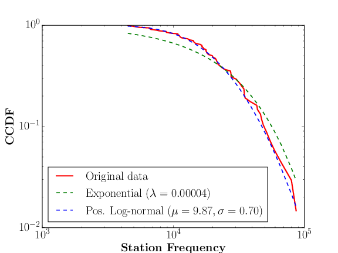
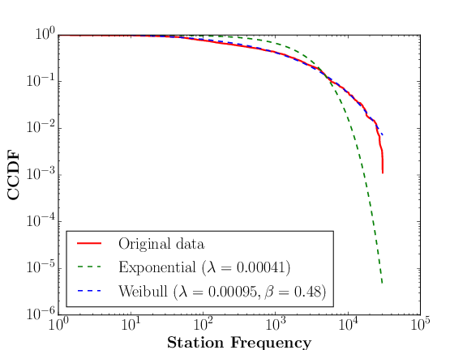

## Mi a személyes adat?

Az [általános európai adatvédelmi törvény](http://eur-lex.europa.eu/legal-content/HU/TXT/HTML/?uri=CELEX:32016R0679&from=HU) ([General Data Protection Regulation (GDPR)]( http://eur-lex.europa.eu/legal-content/EN/TXT/HTML/?uri=CELEX:32016R0679&from=EN)) értelmében személyes adatnak minősül minden olyan információ, ami egy *azonosított* vagy *azonosítható* természetes személyre vonatkozik ([Cikk 4(1)]( https://www.privacy-regulation.eu/hu/4.htm)).
Például ha egy kórházi adatbázisban szerepel a betegek neve, lakóhelyük irányítószáma, 
valamint a betegség diagnózisa (1. táblázat), akkor ez személyes adat ha “valaki” (egy támadó, aki az adatbázist látja) képes meghatározni, hogy egy rekord (sor) melyik személyhez tartozik.
Első pillantásra az 1. táblázat személyes adatnak tűnik a megjelenő nevek mint azonosítók miatt. A valódi válasz egy kicsit árnyaltabb,
mivel előfordulhat, hogy minden névhez több olyan természetes személy tartozik, akik ugyanabban a kerületben laknak és az adatbázisban nem szerepelnek. 

| Rekord | Név | Irányítószám | Betegség |
| --- |---|---|---|
|1. |Fehér Csaba | 1123 | Appendicitis |
|2. | Kovács Kálmán |1117| Meningitis |
|3. | Nagy Tibor | 1113 | Gastroenteritis |
|4. | Kovács Ferenc | 1114 | Alzheimer |
| .. | ... | ... | ...|
1\. táblázat: Kórházi adatok

Tegyük fel, hogy Terike néni szomszédja Kovács Ferenc aki Budapesten lakik.
Terike néni nagy valószínűséggel nem fogja tudni megmondani, hogy a 4. rekord a szomszédjához tartozik, mivel több Kovács Ferenc is élhet a XI. kerületben azonos adatokkal és nem tudja milyen betegségben szenved K. Ferenc. Ha viszont Terike néni és szomszédja egy 100 fős
községben lakik vidéken, ahol csak egyetlen Kovács Ferenc lakik (2. táblázat), akkor Terike néni teljes bizonyossággal
kikövetkeztetheti, hogy a 4. rekord a szomszédjához tartozik. A név és irányítószám külön-külön * „kvázi” azonosítója * a vidéki K. Ferencnek, de együtt már * egyedi  azonosítók * Terike néni számára. A budapesti K. Ferencnek (1. táblázat) viszont együttesen is csak kvázi azonosítója a két attribútum.

| Rekord | Név | Irányítószám | Betegség |
| --- |---|---|---|
|1. |Fehér Csaba | 1123 | Appendicitis |
|2. | Kovács Kálmán |1117| Meningitis |
|3. | Nagy Tibor | 1113 | Gastroenteritis |
|4. | Kovács Ferenc | 8423 | Alzheimer |
| .. | ... | ... | ...|
2\. táblázat: Kórházi adatok vidéki betegekkel

Vagyis a 2. táblázat tartalmaz*hat* személyes adatot (Kovács Ferenc aki egy kis községben lakik),
még akkor is, ha több más rekordok nem minősülnek személyes adatnak * Terike néni számára * (pl. mert a többi beteg Budapesti, és rekordjaikhoz több természetes személy illeszkedik).

Most tegyük fel, hogy Zsuzsa néni nővér aki nem ismeri K. Ferencet és hozzáfér a 1. táblázathoz. Mivel Zsuzsa néni férje NAV ellenőr, ezért hozzáfér minden budapesti demográfiai adatához is (3. táblázathoz), és látja, hogy Budapesten három K. Ferenc él, akik rendre 26, 35, es 65 évesek. Tehát az 1. táblázat 4. rekordja a 3. táblázat 3. rekordjához tartozik, mivel az Alzheimer ritka 26 és 35 éves korban. Vagyis Zsuzsa néni jó eséllyel újra-azonosította a kórházi adatbázis 4. rekordját, és így az személyes adat * Zsuzsa néni számára * (ahol az egyedi azonosítók a név, irányítószám és betegség együtt). 

|Rekord | Név | Adóazonosító jel | Irányítószám | Születési idő |
|--- | ---|---|---| --- | 
|1. | Nagy Olivér | 2346758913 | 8417 | 1965-12-12 | 
|2. | Kovács Ferenc | 6730861841 | 1114| 1991-03-01 |
|3. | Kovács Ferenc | 9770861942 | 1065| 1952-05-08 |
|4. | Kovács Ferenc | 4730361143 | 1022| 1982-11-28 |
|5. | Nagy Rajmund | 8462051823| 1434 | 1954-11-30 |
|6. | Papp Lajos | 7351233971| 5423 | 1988-05-24 |
| ... | ... | ... | ... | ... |
3\. táblázat: Demográfiai adatok

Utolsó példaként vegyünk egy átalakított kórházi adatbázist (4. táblázat), ami abban különbözik az elsőtől, hogy minden beteghez
tárolják a születési dátumot is, viszont a nevük helyett csak a nemüket (férfi/nő) rögzítik. 

| Rekord | Nem | Irányítószám | Születési dátum | Betegség |
|--- | ---|---|---| --- |
|1. | Férfi | 1123 | 1943-01-02 | Appendicitis |
|2. | Férfi |1117| 1976-08-12 | Meningitis |
|3. | Férfi | 1113 | 1981-01-31 | Gastroenteritis |
|4. | Férfi | 1114 | 1971-03-01 | Bronchitis |
| ... | ... | ... | ... | ...|
4\. táblázat: Kórházi adatok átalaktíva

Első ránézésre, egy ilyen adatbázis már nem tartalmaz személyes adatot, hiszen a nevet mint attribútumot eltávolítottuk. Paradox módon,
egy ilyen adatbázis is tartalmazhat személyes adatot, mivel a születési dátum, nem, és írányítószám együttese azonosíthat valakit (ugyan sok ezer ember született azonos napon mint K. Ferenc vagy lakik azonos irányítószám
alatt, azon emberek száma akik azonos napon születtek **és** az irányítószámuk is azonos K. Ferenc irányítószámával már jóval kevesebb).
[Több tanulmányban]( http://www.privacylives.com/wp-content/uploads/2010/01/golle-reidentification-deanonymization-2006.pdf) is megmutatták, hogy egy milliós populációban az egyének majdnem közel 63%-ának egyedi a nemének, irányítószámának, 
és születési dátumának az együttese, vagyis jó eséllyel nincs még egy olyan ember Magyarországon, aki azonos nemű és akkor született és ott lakik mint az Olvasó. 

Tegyük fel, hogy Gizi néni (vagy férje) egy állami szervnél dolgozik, ahol hozzáfér az állampolgárok pontos
születési idejéhez és lakhelyéhez (2. táblázat). A fentiek miatt egy olyan kórházi adatbázisban mint a 4. táblázat akár a betegek 63%-ához hozzárendelheti a pontos identitásukat, hiszen minden kórházi rekordhoz hozzá tudja rendelni a neki megfelelő állampolgári adatokat * ha az irányítószám, születési dátum és nem mint attribútumok implicit vagy explicit módon megjelennek mindkét adatbázisban. * 
Ebben az esetben a név, irányítószám és nem együttese egyedi azonosítója az emberek 63%-ának * Gizi néni számára *. 

<!---
### Egyedi és kvázi azonosítók

Összegezve, az egyedi azonosítók az attribútumok egy olyan részhalmaza, amelyek együttes értékei egyértelműen azonosítanak egy természetes személyt a populációban. Például a név nem egyedi hanem kvázi-azonosító (1. táblázat), de az adóazonosító jel, TAJ szám, bankszámlaszám (2. táblázat) már egyedi azonosítók. Egy személy nemének, lakhelyének, és születési dátumának kombinációja az emberek 63%-ának egyedi, a többinek pedig kvázi azonosítója, mert szükséges még egyéb attribútumok ismerete az egyértelmű azonosításhoz.
-->

### Plauzibilitás és sikervalószínűségek 
Jogosan felmerülhet kérdés; ha Zsuzsa néni jó eséllyel újra tudja azonosítani az 1. táblázat 4. rekordját de Terike néni nem, akkor az személyes adat a GDPR szerint? Hasonlóan ha Gizi néni minden embert 63%-os valószínűséggel azonosít, de egyiket sem teljes bizonyossággal, akkor a 4. táblázat bármely rekordja személyes adatnak minősül vagy sem? Hasonló bizonytalanság fellép Zsuzsa néni esetében, hiszen ritkán de [fiatal felnőttek is szenvedhetnek Alzheimer kórban]( https://en.wikipedia.org/wiki/Early-onset_Alzheimer%27s_disease). Láthatóan Terike néni hihetőbb támadó mint a többiek, hiszen neki „csak” a kórházi adatokhoz kell hozzáférnie és nincs szüksége a 3. táblázathoz, hogy a szomszédja adatát lokalizálja az 1. táblázatban.
A GDPR nem definiál explicit felső korlátot arra, hogy mennyire kell egy támadónak plauzibilisnek lennie, és arra sem, hogy ilyen támadásoknak milyen minimális sikervalószínűségűeknek kell lenniük ahhoz, hogy egy rekord azonosítható legyen (azaz személyesnek minősüljön). Viszont megköveteli, hogy a sikervalószínűségek ésszerűen alacsony értékek legyenek ** minden rekordra ** az adatbázisban a lehető legtöbb plauzibilis támadót figyelembe véve ([Recital 26]( https://www.privacy-regulation.eu/hu/r26.htm)).

A plauzibilitás és sikervalószínűségek becslésénél figyelembe kell venni a tényt, hogy a potenciális támadók nem feltétlen ismerik a (kvázi) azonosítók összes elemét (pl. csak az irányítószámot, de a születési dátumot nem), valamint ezek megtanulása túl költséges lehet számukra. 
Például ha a való életben létezik egy Terike néni (vagyis plauzibilis), akkor K. Ferenc rekordja a 2. táblázatban személyes adatnak minősül. Ha Zsuzsa és Gizi néni létezése hihető (vagyis plauzibilis, hogy hozzáférnek a 3. és 4. táblázathoz és ez számukra nem okoz túl nagy költséget), akkor K. Ferenc rekordja az 1. és 4. táblázatban is személyes adatnak minősülhet. Viszont az utóbbi megítélése már nem egyértelmű tekintve a 37%-os hibavalószínűséget Gizi néni esetén, illetve a fiatalkori Alzheimer esélyét Zsuzsa néni esetén. 

**Egy adat személyes jellege tehát attól függ, hogy milyen potenciális támadók férhetnek hozzá az adathoz és azok képesek-e meghatározni legalább egy rekord tulajdonosát mint természetes személyt. ** 
Ennek megítéléséhez szükséges minden plauzibilis támadás feltérképezése és azok sikervalószínűségeinek becslése.
Általánosan igaz, hogy a belső alkalmazottak (a fenti esetben nővérek) gyakran a legvalószínűbb támadók,
hiszen részükről kevés technikai felkészültséget igényel az adatlopás (eleve hozzáférésük
van az adatbázisokhoz) függetlenül attól, hogy milyen biztonsági megoldásokkal (tűzfal, jelszó,
antivirus, hálózati szegregálás, stb.) védik a kórházi és állami rendszereket külső „hacker” támadásoktól (miközben [ezen védelmek sem nyújtanak garanciát](https://www.theguardian.com/business/2014/oct/02/jp-morgan-76m-households-affected-data-breach) külső támadásokkal szemben).

Megjegyzendő, hogy a fenti ** adatok nem azért személyesek, mert érzékeny információt tartalmaznak (pl. betegség), hanem azért, mert egy plauzibilis támadó képes megmondani, hogy melyik rekord melyik természetes személyhez tartozik, függetlenül az adat jellegétől.** Más szavakkal, ha a fenti táblázatok nem tartalmaznák a betegséget mint attribútumot, attól még személyes adatnak minősülhetnek és vonatkozhatnak rá a GDPR kötelezettségei.

<!---
A fentiek miatt az adat személyes jellegének a megítélése nem kizárólag bizonyos attribútumok ismeretéhez
kötött (pl. név, telefonszám, TAJ szám stb.), hanem attribútumok "reális" ismeretéhez. Vagyis a megválaszolandó kérdés, hogy létezik-e olyan plauzibilis támadó,
aki reális eséllyel újra-azonosíthat *legalább egy* személyt egy adatbázisban.
Ha eltávolítjuk az összes közvetlen azonosítót -- pl. nevet, telefonszámot, TAJ számot, stb., amit
pseudoanonimizációnak is hívnak -- akkor az adatbázis meg lehet személyes, ha létezik olyan támadó (pl. szomszéd Terike néni aki nővér)
aki akar egy rekordot (csak K. Ferencet) is újra-azonosít a kórházi adatbázisban. 
-->
## Személyes adatok mérése 

Hogyan állapíthatjuk meg, hogy egy adatbázis személyes adatokat tartalmaz és így a GDPR hatásköre alá esik? 
Néhány esetben ez könnyű, például amikor valamely rekord a legtöbb támadó számára egyedi azonosítót tartalmaz (pl. TAJ szám vagy bankszámlaszám). Akkor sem túl nehéz, ha létezik olyan publikusan elérhető másik adatbázis (3. táblázat) amely tartalmazza a azonosítók értékeit néhány rekordra, vagyis Zsuzsa és Gizi néni plauzibilis.

Általános esetben viszont meg kell becsülni minden plauzibilis támadó sikervalószínűségét, ami általában lehetetlen
(ez persze nem ment fel a GDPR kötelezettsége alól, amely [előír](https://www.privacy-regulation.eu/hu/35.htm) egy ilyen
"best-effort" jellegű elemzést az adat felhasználásától függően). Honnan lehetne tudni, hogy több ezer beteg közül kinek van olyan ismerőse aki hozzáfér a kórházi adatokhoz (pl. egy szomszéd, barát, családtag, munkáltató vagy kolléga, biztosító, bank, stb.) és az mit tud egy betegről vagy betegek demográfiai adatáról ami a beteg egyedi azonosítója lehet * a populációban *? 

Vegyük Terike néni esetét a vidéken élő K. Ferenccel, de most Terike néni csak az 5. táblázathoz fér hozzá. Ha Terike néni ismeri K. Ferenc nevét, lakhelyét (8423) születési évét (1971), akkor még nem tudja eldönteni, hogy a 3. vagy 4. rekord tartozik hozzá ebben a táblázatban. Ha viszont tudja, hogy a szomszédja gyakran köhög (a pontos betegségét viszont nem ismeri), akkor szinte teljesen biztos lehet benne, hogy a 4. rekord tartozik hozzá mivel a táblázatban más betegségnek nem tünete a köhögés. Vagyis ebben az esetben a 4. rekord bizonyosan személyes adat, amelynek egyedi azonosítója a neve, az irányítószáma, a születési éve, és a betegségének egy tünete (köhögés). 

| Rekord | Nem | Irányítószám | Születési dátum | Betegség |
|--- | ---|---|---| --- |
|1. | Kovács Attila | 1123 | 1943-*-02 | Meningitis |
|2. | Kovács Attila |1123| 1943-*-02 | Appendicitis |
|3. | Kovács Ferenc | 8423 | 1971-01-* | Gastroenteritis |
|4. | Kovács Ferenc | 8423 | 1971-01-* | Bronchitis |
|5. | Nagy Tibor | 1313 | 1981-\*-\* | Appendicitis |
|6. | Nagy Tibor | 1313 | 1981-\*-\* | Meningitis |
5\. táblázat: Kórházi adatok 

Látható, hogy nagyon ** nehéz feltételezéséket szabni egy támadó háttértudására és így meghatározni a plauzbilitását. ** Napjainkban egyre több adatot osztanak meg magukról emberek akarva vagy akaratlan, így nem lehet tudni, hogy ki rendelkezik elég tudással ahhoz, megtalálja az illető rekordját egy adatbázisban. 

### Adatok egyedisége az adatbázisban és a populációban
A fenti nehézségek ellenére a GDPR [előírhatja](https://www.privacy-regulation.eu/hu/35.htm) az adatok azonosíthatóságának best-effort elemzését, aminek megítélése sajnos elég szubjektív, hiszen mindig kimaradhat egy Terike néni a felsorolásból, akinek létezése csak később lesz nyilvánvaló. Vagyis ** az adat azonosíthatósága (és személyes jellege) idővel változhat. ** Ennek a törvény tudatában van, és ezért ezekben az esetekben [újabb](https://www.privacy-regulation.eu/hu/35.htm) analízist elő.

Az azonosíthatóság eldöntéséhez szükséges tudnunk, hogy egy rekord attribútum-értékei mennyire egyediek a populációban (és nem az adatbázisban), ahonnan a rekord számazik. Visszautalva az első példára, ha több Kovács Ferenc nevű ember él a XI. kerületben, akkor az 1. táblázat 4. rekordja nem személyes adat Terike néni (és valószínűleg senki más) számára. Annak eldöntése, hogy egy rekord egyedi-e az adott populációban viszont általában nehéz, hiszen ritkán ismerjük a populáció minden tagját. Ugyan léteznek [statisztikai modellek és eszközök rekordok egyediségének becslésére egy populációban]( http://www.ihsn.org/sites/default/files/resources/ihsn-working-paper-007-Oct27.pdf), ezen modellek többsége legjobb esetben is csak az átlagos de nem a legrosszabb esetekre adnak valamilyen mérőszámot rekordok egyediségére.    
  
A személyes adatok egy egyszerűbb és objektívebb indikátora a gyakorlatban a rekordok egyedisége ** az adatbázisban ** (és nem a populációban).
Egy rekord egyedi, ha attribútumok egy részhalmazának-értékei (amit egy plauzibilis támadó ismerhet és így azonosíthatja a rekord tulajdonosát) egyediek rá nézve
az adatbázisban, vagyis nincs más rekord aminek ilyen attribútum-értékei lennének. 
A fenti példában, ha K. Ferenc egyedi a nemét, irányítószámát, és születési
dátumát nézve a 2. táblázatban, akkor Terike néni könnyen lokalizálhatja vidéki szomszédjának rekordját. Ha viszont k rekord rendelkezik ilyen
attribútum értékekkel, akkor Terike néni nem tudja meghatározni, hogy melyik rekord tartozik a szomszédjához, * feltéve, hogy nincs más információja szomszédja betegségének tüneteiről * (pontosabban ha tippel, akkor az esélye, hogy eltalálja a szomszédja rekordját 1/k). Ezt illusztrálja az 5. táblázat, ahol k = 2. 

| Rekord | Nem | Irányítószám | Születési dátum  | Betegség |
|--- | ---|---|---| --- |
|1. | Férfi | 1123 | 1943-*-02 | Meningitis |
|2. | Férfi |1123| 1943-*-02 | Appendicitis |
|3. | Férfi | 8423 | 1971-01-* | Bronchitis |
|4. | Férfi | 8423 | 1971-01-* | Appendicitis |
|5. | Nő | 1313 | 1981-\*-\* | Appendicitis |
|6. | Nő | 1313 | 1981-\*-\* | Meningitis |
5\. táblázat: Kórházi adatok, k = 2

Természetesen, ** ha egy rekord egyedi az adatbázisban, az nem jelenti azt, hogy egyedi a populációban is ** (ld. a budapesti Kovács Ferenc esetét az 1. táblázatban). Más szavakkal egyedi rekordok az adatbázisban nem feltétlen minősülnek személyes adatnak, de nem túl biztatóak ilyen rekordok jelenléte főleg ha a populáción belüli egyediségét nem lehet cáfolni vagy az adatbázis tartalmazza a populáció nagy részét (ami nem ritka manapság). 
Ezért a gyakorlatban legtöbbször csak az adatbázison belüli egyediséget használják az adat személyességének mérésére; ha egy adatbázisban vannak olyan rekordok, amelyek egyediek valamely plauzibilis támadó számára (Terike néni aki ismeri a lakhelyet, nevet és születési dátumot), akkor jó eséllyel tartalmaz személyes adatot az adatbázis. 
<!---
Egy fontos dolog megjegyzendő: A fenti példákban feltételeztük, hogy ha egy rekord nem egyedi a populációban, de egyedi az adatbázisban akkor személyes. 
Ez viszont nem zárja ki, hogy a rekord értékei (pl. betegség) teljes pontossággal megtanulhatóak. Valóban, ha több K. Ferenc él a XI. Kerületben és azok mindegyike illeszkedig az 1. táblázat 4. rekordjára, akkor mindegyik Bronchitisben szenved, tehát Terike néni budapesti szomszédja is.  Hasonlóan,
függetlenül k értékétől az 5. táblázatban, a betegség mindig teljes bizonyossággal megtanulható, hiszen minden k rekordhoz azonos betegség tartozik. Pl. nem számít, hogy a 3. és 4. rekordok egyaránt tartozhatnak K. Ferenchez, a betegsége mindenképpen Bronchitis. Vagyis ** ha egy személy rekordja nem lokalizálható egyértelműen attól még az adata megtanulható teljes bizonyossággal ** (beleértve a betegségét). A GDPR eredeti szövegezése nem tér ki az ilyen esetekre, és csak a rekordok lokalizálhatóságát (a személy azonosíthatóságát) vizsgálja. 
-->

### Komplex, sok attribútumú személyes adatok 

Napjaink legtöbb adathalmaza lényegesen több attribútumot tartalmaz mint a fenti kórházi adatbázis.
Például tartalmazhatja egy személy által meglátogatott helyeket, megvásárolt termékeket, megnézett
filmeket, stb. Az összes attribútumok száma ilyenkor megegyezik az összes lehetséges hellyel,
megvásárolható termékkel, vagy létező filmmel, melyek száma akár több ezer is lehet, értékük pedig
1 ha a kérdéses személy meglátogatta/megvásárolta/megtekintette az adott
helyet/árut/filmet, máskülönben 0. Egy ilyen adatbázist illusztrál a 6. táblázat, ahol az attribútumok Budapest főbb helyeinek ([POI](https://hu.wikipedia.org/wiki/POI)) felel meg.

| Rekord | Móricz Zsigmond körtér | Allee | Mom park | ... | Moszkva tér|
|--- | ---|---|---| --- | --- |
|1. | 0| 1 | 1 | ... | 0 |
|2. | 1| 1 | 1 | ... | 0 |
|3. | 0| 0 | 0 | ... | 1 |
|4. | 0| 0 | 1 | ... | 1 |
| ... | ... | ... | ... | ...| ... |
6\. táblázat: Komplex adatbázis

Az ilyen adathalmazok szinte [mindig]( https://www.cs.utexas.edu/~shmat/shmat_oak08netflix.pdf) személyes adatnak minősülnek, mivel (1) a rekordok általában rendkívül egyediek az attribútumok nagy száma miatt (2) a sok attribútum közül elég csak néhanyat ismerni ahhoz, hogy a illető rekordját lokalizálni tudjuk, (3) az ilyen nagy adathalmazok gyakran a populáció jó részét lefedik.
 Például tegyük fel, hogy bárki megismerheti egy személy K meglátogatott helyét az illető Facebook/Instagram profilját elemezve. Tegyük fel továbbá, hogy egy telecom cég szeretné megosztani egy másik céggel minden egyes előfizetője által meglátogatott helyek (cella tornyok) listáját úgy, hogy más attribútumot (név, telefonszám, stb.) nem oszt meg az előfizetőkről. Személyes adat-e az előfizetőnkénti meglátogatott helyek listája? Nagy valószínűséggel [igen](https://www.nature.com/articles/srep01376), hiszen kevesebb mint 5-10 torony (POI) ismerete egyedivé tesz egy rekordot. Ezt a jelenséget a következőkben illusztráljuk egy hasonló példán.

## Esettanulmány: Tömegközlekedési adatok

Példaként nézzünk egy komplexebb adathalmazt, ami tartalmazza egy 1.5 millió lakosú város közlekedési metró- es busz hálózatának használatát. Adott két adatbázis, amelynek minden egyes sora megfelel egy elektronikus jegynek, és tartalmazza azon állomások listáját, ahol a jegyet érvényesítették/leolvasták. A továbbiakban tegyük fel, hogy egy utas csakis egy jegyet használt a megfigyelt időtartamban (3 nap), vagyis minden sor megfelel egy utas által meglátogatott állomások egy részhalmazának (tehát egy állomás csak egyszer szerepelhet egy rekordban). 
A metró adatbázisban összesen 68 állomás (attribútum) 
és 847 668 utas (rekord) található. A busz adatbázisban 893 állomás (attribútum) és 773 295 utas (rekord).
Az adatbázisok főbb jellemzőit a 6. táblázat mutatja.

| | Metró | Busz|
|---|---|---|
| Utasok száma | 847,668 | 773,295 |
| Állomások száma | 68 |893 |
| Legtöbb állomás utasonként | 26 |53 |
| Átlagos állomások száma utasonként| 1.97 |2.75 |
| Állomások számának szórása utasonként|  1.64 |  2.53 |

6\. táblázat: Metró- és buszállomások látogatottsága

Két főbb támadást képzelhetünk el:
1. A támadó ismeri egy tetszőleges utas K tetszőleges állomását, és lokalizálni szeretné az utas rekordját. 
2. A támadó ismeri egy tetszőleges utas K legtöbbször látogatott
állomását (vagyis az utas TOP K állomását), és lokalizálni szeretné az utas rekordját.

A cél mindkét esetben az utas többi állomásának kiolvasása a megtalált rekordból
. Mindkét támadás plauzibilis ha K nem túl nagy, hiszen szinte bármely utas publikus közösségi profiljából (Facebook/Instagram/Twitter stb.) könnyen meghatározható az általuk meglátogatott helyek és így az azokhoz legközelebben elhelyezkedő állomások listája (pl. lakóhely,
 munkahelyhez, egyéb szabadidős tevékenység). A sikervalószínűség mindkét esetben K értékétől függ, amit alább becslünk a rekordok egyediségével (az adatbázisban).

### TOP K állomások egyedisége

Először minden utas TOP K állomását meghatározzuk, majd megnézzük, hogy hány utasnak egyedi a TOP K állomása az adatbázisban. Ez könnyű. Az alábbi táblázat mutatja, hogy az adatbázis rekordjainak hány százaléka egyedi a TOP K állomásukat tekintve.

|Top-K | Metró | Busz |
|---|---|---|
|Top-2 | 0.03% |5.56% |
|Top-3 | 21.4% |41.4% |
|Top-4 | 82.1% |79.4% |
|Top-5 | 97.4% |96.3% |

Látható, hogy az utasok 21%-ának egyedi a TOP 3 állomása. A gyakorlatban a TOP-3 állomás könnyen meghatározható egy személyről, de sokan jóval több információt megosztanak magukról közösségi portálokon (pl. képek formájában), ezért náluk akár K > 5 támadó is lehet plauzibilis több mint 95%-os sikervalószínűséggel, feltéve ha az adatbázis elég nagy és nagyjából lefedi az egész populációt.

### Tetszőleges K állomás egyedisége

A rekordokban előforduló összes K állomás vizsgálata túl sokáig tartana, ezért inkább egyszerű véletlen mintavételezéssel becsüljük az egyediséget. A [részleteket](https://arxiv.org/pdf/1507.07851.pdf) mellőzve, itt egy egyszerű módszert mutatunk.

Első lépésként véletlenszerűen kiválasztunk egy rekordot (minden rekordot ugyanolyan eséllyel), majd annak K tetszőleges állomását szintén
véletlenszerűen (minden K állomást a rekordból ugyanolyan valószínűséggel). Végül megnézzük, hogy hány másik utas rekordja tartalmazza ezt a K állomást. A
kísérlet sikeres, ha nincs más utas akinek rekordjában szerepel ez a K állomás (vagyis az első
lépésben kiválasztott rekord egyedi a második lépésben kiválasztott állomásait tekintve).
Ezt a kísérletet megismételjük elég sokszor (mondjuk 10000), és kiszámoljuk a sikeres kísérletek százalékos arányát, amelyet az alábbi táblázat mutat.  

|K | Metró | Busz |
|---|---|---|
|2 | 12.7% |23.8% |
|3 | 20.2% |35.7% |
|4 | 32.4% |48.6% |
|5 | 52.7% |52.7% |
|6 | 74.1% |62.2% |
|7 | 87.7% |83.8% |

### Egyediség egyéb indikátorai

Az egyediség egy másik és gyorsabban számolható (de kevésbbé pontos) indikátora lehet a sok egyedi rekordot tartalmazó adatbázisok [két globális tulajdonsága](https://www.cs.utexas.edu/~shmat/shmat_oak08netflix.pdf): az adatritkaság
(**sparseness**) és az állomások gyakoriságának [**heavy tailed**](https://en.wikipedia.org/wiki/Heavy-tailed_distribution) eloszlása. 

Egy adathalmaz ritka, ha minden utas csak néhány állomást látogatott meg. Ez a mi esetünkben valóban igaz, hiszen az
átlagos állomás-szám rekordonként kevesebb mint 3 mindkét adathalmazra, aminek a szórása szintén kisebb mint 3. 

A heavy-tailed tulajdonság nagyjából azt jelenti, hogy a legtöbb állomás gyakorisága alacsony az adathalmazban. Precízebben fogalmazva, ha ábrázoljuk az állomások elfordulási számának (gyakoriságának) eloszlását az adatbázisban, akkor ezen eloszlás sűrűségfüggvényének a farka "vastagabb", mint egy [exponenciális eloszlás](https://en.wikipedia.org/wiki/Exponential_distribution) sűrűségfüggvényének farka. Ilyen ismertebb eloszlások pl. a [power law](https://en.wikipedia.org/wiki/Power_law) és a [log-normál]( https://en.wikipedia.org/wiki/Log-normal_distribution).
A következő ábrák illusztrálják a metró es busz adathalmazok heavy-tailed tulajdonságát. Ábrázoltuk az
állomások gyakoriságának a kumulatív eloszlás függvényét ([CCDF](https://en.wikipedia.org/wiki/Cumulative_distribution_function)), valamint az erre legjobban illeszkedő exponenciális és heavy-tailed modellt. Ezen ábrák mutatják, hogy az exponenciális modell lényegesen rosszabbul illeszkedik mint a legjobb heavy-tailed modellek, amelyek a mi esetünkben a
pozitív log-normál és [Weibull](https://en.wikipedia.org/wiki/Weibull_distribution) eloszlások voltak. Az illeszkedést a [powerlaw]( https://pypi.python.org/pypi/powerlaw) python csomaggal számoltuk. Érdemes megjegyezni, hogy a vizsgált heavy-tailed eloszlásoknak több paraméterük van mint az exponenciális eloszlásnak, ezért [overfitting]( https://en.wikipedia.org/wiki/Overfitting) miatt a heavy-tailed eloszlások lehet, hogy csak az adatbázist modellezik pontosabban de nem a populációt (habár ennek esélye kicsi, mivel az adatbázisok jelen esetben elég nagyok).   

Metro             |  Busz
:-------------------------:|:-------------------------:
|  

### Konklúzió

Láthattuk, hogy az adatok azonosíthatóságának és így személyes jellegének megítélése attól függ, hogy ki férhet hozzá az adathoz és milyen előzetes (háttér)tudással rendelkezik az adattulajdonosokról. Viszont a támadó plauzibilitását (az egyénekről alkotott háttértudását) nehéz igazolni. Ennek oka, hogy napjainkban rengeteg adat érhető el az emberekről, amit részben ő maguk részben más [cégek](https://en.wikipedia.org/wiki/AOL_search_data_leak) vagy [személyek](http://fc13.ifca.ai/proc/10-1.pdf) osztanak meg akarva vagy akaratlanul. Az azonosíthatóság sikervalószínűségét sem mindig könnyű számolni, főleg ha az adat komplex (sok attribútumot tartalmaz).

Megmutattuk, hogy egy Budapest nagyságú városban a tömegközelekedést használó emberek által meglátogatott állomások listája egyedi, és kevesebb mint 5 állomás ismerete elég ahhoz, hogy egy ilyen adatbázisban bárki azonosítson egy utast és kiolvassa az összes általa érintett állomást. Így ez az adatbázis nagy valószínűséggel személyes adat. Ez azt is jelenti, hogy ha a rendszert üzemeltető cég meg szeretné osztani ezt az adatot egy harmadik féllel adatelemzés céljából (pl. hogy lássák hova kell új állomást építeni), ahhoz vagy az utasok beleegyezését kell kérniük, vagy anonimizálni kell az adatbázist úgy, hogy már nem azonosítható benne senki és így nem vonatkoznak rá a GDPR kötelezettségei. Ez a kérdés könnyen aktuálissá válhat Budapesten is	 a [közelgő elektronikus jegyrendszer]( http://rigo.bkk.hu/) bevezetésével.
   
Végül megjegyezzük, hogy a leírt megállapítások minden adatra igazak ahol személyekről tárolnak bármilyen (nem feltétlenül érzékeny) adatot és ezek a személyek valamely plauzibilis támadó által azonosíthatók.

<!---
‘personal data’ means any information relating to an identified or identifiable natural person (‘data subject’); an identifiable natural person is one who can be identified, directly or indirectly, in particular by reference to an identifier such as a name, an identification number, location data, an online identifier or to one or more factors specific to the physical, physiological, genetic, mental, economic, cultural or social identity of that natural person;

To determine whether a natural person is identifiable, account should be taken of all the means reasonably likely to be used, such as singling out, either by the controller or by another person to identify the natural person directly or indirectly. To ascertain whether means are reasonably likely to be used to identify the natural person, account should be taken of all objective factors, such as the costs of and the amount of time required for identification, taking into consideration the available technology at the time of the processing and technological developments. The principles of data protection should therefore not apply to anonymous information, namely information which does not relate to an identified or identifiable natural person or to personal data rendered anonymous in such a manner that the data subject is not or no longer identifiable. This Regulation does not therefore concern the processing of such anonymous information, including for statistical or research purposes.

remove identifying particulars or details from (something, especially medical test results) for statistical or other purposes: anonymized testing of routine blood samples.
-->

